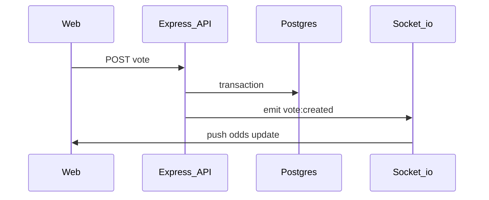

<div align="center">

# SarradaBet

**Mock betting platform with real-time odds, optimistic voting, and shared TypeScript contracts.**

[](https://github.com/SarradaHub/sarradabet/actions/workflows/ci.yml)
[](https://github.com/SarradaHub/sarradabet/issues)
[](https://nodejs.org/)
[](https://www.typescriptlang.org/)

[Explore the docs](docs/README.md) ·
[Report Bug](.github/ISSUE_TEMPLATE/bug_report.md) ·
[Request Feature](.github/ISSUE_TEMPLATE/feature_request.md)

</div>

## Table of Contents

- [About The Project](#about-the-project)
  - [Built With](#built-with)
- [Architecture](#architecture)
- [Getting Started](#getting-started)
  - [Prerequisites](#prerequisites)
  - [Installation](#installation)
- [Usage](#usage)
- [Deployment](#deployment)
- [Testing](#testing)
- [Roadmap](#roadmap)
- [Contributing](#contributing)
- [Contact](#contact)
- [Acknowledgments](#acknowledgments)

## About The Project

SarradaBet is a mock betting platform built as a Turborepo monorepo. It combines an Express API, a React frontend, and shared TypeScript contracts, with real-time odds updates over Socket.io and PostgreSQL.

**Why this project exists**

- Demonstrate a full-stack betting flow — markets, odds, votes, and admin resolution — without payment rails.
- Show realtime UX patterns: Socket.io push updates, optimistic voting, and cache reconciliation.
- Keep API and web in sync through a shared `@sarradabet/types` package.

**Key features**

- Create and manage betting markets, odds, and categories with full CRUD support.
- **Real-time updates** — vote counts and bet changes push instantly to all connected clients via Socket.io (no polling).
- **Optimistic UI** — votes feel instant; the client reconciles with server events on success or rolls back on error.
- Request validation, rate limiting, compression, and structured error responses on the API.
- In-memory caching for categories and resolved bets, plus slim list payloads for faster responses.
- Shared types in `packages/types` (`@sarradabet/types`) consumed by both API and web.

<p align="right">(<a href="#table-of-contents">back to top</a>)</p>

### Built With

[](https://react.dev/)
[](https://vitejs.dev/)
[](https://expressjs.com/)
[](https://socket.io/)
[](https://www.prisma.io/)
[](https://www.postgresql.org/)
[](https://turbo.build/)
[](https://tailwindcss.com/)

| Layer | Stack |
|-------|-------|
| Frontend | React, Vite, Tailwind CSS — deploy on **Vercel** (`apps/web`) |
| Backend | Express, Socket.io, Prisma — deploy on **Vercel** (`apps/api`) or **Render** |
| Database | PostgreSQL — **Supabase** (or local Docker) |
| Monorepo | Turborepo, shared `@sarradabet/types` |

<p align="right">(<a href="#table-of-contents">back to top</a>)</p>

## Architecture

SarradaBet follows **Clean Architecture** on the API with a **Socket.io realtime layer** for push updates. Shared contracts live in `@sarradabet/types` so the web and API stay aligned.

### Monorepo layout

```
sarradabet/
├── apps/
│   ├── api/    # Express API, Prisma, Socket.io, node-cache
│   └── web/    # React SPA, RealtimeProvider, optimistic voting UI
├── packages/
│   └── types/  # Shared contracts (bets, categories, realtime events)
├── docs/       # Architecture, deployment, performance notes
└── docker-compose.yml
```

### Backend layers

The API (`apps/api`) separates concerns across four layers:

```
┌─────────────────────────────────────┐
│  Presentation  — routes, middleware │
├─────────────────────────────────────┤
│  Application   — controllers        │
├─────────────────────────────────────┤
│  Domain        — services, rules    │
├─────────────────────────────────────┤
│  Infrastructure — repositories, DB  │
└─────────────────────────────────────┘
```

| Layer | Location | Responsibility |
|-------|----------|----------------|
| Presentation | `routes/`, `core/middleware/` | HTTP routing, validation, security, error handling |
| Application | `modules/*/controllers/` | Request/response handling, input parsing |
| Domain | `modules/*/services/` | Business logic, vote aggregation, event emission |
| Infrastructure | `modules/*/repositories/`, Prisma | Data access and persistence |

Feature modules (`bet`, `category`, `admin`) each own their repository, service, and controller. The realtime layer (`realtime/`) broadcasts typed Socket.io events after successful DB writes.

### Realtime data flow

Vote and bet mutations emit Socket.io events after the database transaction succeeds. Clients subscribe instead of polling REST.



| Event | When |
|-------|------|
| `vote:created` | A user votes on an odd |
| `bet:created` | A new bet is created |
| `bet:updated` | Bet updated, closed, or resolved |

Event contracts: [`packages/types/src/realtime.ts`](packages/types/src/realtime.ts). The web app wraps routes in `RealtimeProvider`, which patches the query cache when events arrive. Individual `BetCard` components also listen for vote events to update odds locally.

### Shared types

`@sarradabet/types` exports `BetListItem`, `BetDetail`, `Category`, and `RealtimeEvents`. Both `apps/api` and `apps/web` depend on it — change contracts here when altering API or realtime payloads.

### Further reading

- [Architecture documentation](docs/ARCHITECTURE.md) — layer details, caching, frontend patterns
- [API reference](docs/API.md) — REST endpoints and Socket.io payloads
- [Performance guide](docs/PERFORMANCE.md) — pooling, compression, multi-instance scaling

<p align="right">(<a href="#table-of-contents">back to top</a>)</p>

## Getting Started

Follow these steps to run SarradaBet locally.

### Prerequisites

- Node.js ≥ 20
- Docker (for local Postgres), or a Supabase project

### Installation

1. **Clone the repository**

   ```bash
   git clone https://github.com/SarradaHub/sarradabet.git
   cd sarradabet
   ```

2. **Install dependencies**

   ```bash
   npm install
   ```

3. **Configure environment**

   ```bash
   cp apps/api/.env.example apps/api/.env
   cp apps/web/.env.example apps/web/.env
   ```

   **Local development (Docker Postgres)** — defaults in `.env.example` work out of the box:

   | Variable | Purpose |
   |----------|---------|
   | `DATABASE_URL` | Postgres connection (`localhost:5433` via Docker) |
   | `DIRECT_URL` | Direct Postgres URL for Prisma migrations (same as `DATABASE_URL` locally) |
   | `CORS_ORIGINS` | Must include the web dev URL (`http://localhost:3002`) |
   | `VITE_API_URL` | Web → API base URL (`http://localhost:8000`) |

   **Supabase (production / remote DB)** — edit `apps/api/.env`:

   ```env
   DATABASE_URL=postgresql://...@...pooler.supabase.com:6543/postgres?pgbouncer=true
   DIRECT_URL=postgresql://...@...supabase.com:5432/postgres
   ```

   See [docs/PERFORMANCE.md](docs/PERFORMANCE.md) for pooler setup and query tuning.

4. **Start the database**

   ```bash
   docker compose up -d db
   ```

   The service is named `db` (not `postgres`). Postgres listens on host port **5433**.

5. **Run migrations**

   ```bash
   cd apps/api
   npm run prisma:migrate:dev
   ```

   Optional seed:

   ```bash
   npm run db:seed:simple
   ```

6. **Start dev servers**

   From the repository root:

   ```bash
   npm run dev
   ```

   | Service | URL |
   |---------|-----|
   | API (REST) | http://localhost:8000 |
   | API (health) | http://localhost:8000/health |
   | Socket.io | http://localhost:8000/socket.io |
   | Web | http://localhost:3002 |

   Vite proxies `/api` and `/socket.io` to the API in dev, so the web app can talk to the backend without CORS issues when using relative paths. With `VITE_API_URL` set, the client connects directly to the API (ensure `CORS_ORIGINS` includes `http://localhost:3002`).

<p align="right">(<a href="#table-of-contents">back to top</a>)</p>

## Usage

Once the dev servers are running:

1. **Browse bets** — open http://localhost:3002 to view active markets and odds.
2. **Vote** — click an odd to cast a vote; the UI updates optimistically, then reconciles via Socket.io.
3. **Admin** — authenticated admin routes (JWT via `JWT_SECRET`) manage bet creation, closure, and resolution.

For REST endpoints and Socket.io event payloads, see [docs/API.md](docs/API.md).

<p align="right">(<a href="#table-of-contents">back to top</a>)</p>

## Deployment

Use **two Vercel projects** from the same repo (e.g. `sarradabet-web` and `sarradabet-api`), each with its own root directory and `vercel.json` ([web](apps/web/vercel.json), [api](apps/api/vercel.json)). Do not point the API project at the repository root — root [`vercel.json`](vercel.json) is for the web app only (platform design-system clone).

### API (Vercel)

- **Root directory:** `apps/api`
- **Install / build:** [`apps/api/vercel.json`](apps/api/vercel.json) — `npm ci` and `turbo run build --filter=api` from the monorepo root (no `clone-platform.sh`; that script is web-only).
- **Environment:** `DATABASE_URL`, `DIRECT_URL` (Supabase), `CORS_ORIGINS` (your Vercel web URL), `JWT_SECRET`, `NODE_ENV=production`.
- **WebSockets:** supported on a single Vercel deployment; see [docs/PERFORMANCE.md](docs/PERFORMANCE.md) for multi-instance Redis adapter notes.

### API (Render, alternative)

- **Root directory:** `apps/api`
- Build: `npm install && npm run build && npm run prisma:generate`
- Start: `npm run start`
- Same environment variables as above; Render sets `PORT` automatically.

### Web (Vercel)

- **Root directory:** `apps/web` (recommended) or `.` (monorepo root — see [docs/DEPLOYMENT.md](docs/DEPLOYMENT.md))
- **Install / build:** [`apps/web/vercel.json`](apps/web/vercel.json) clones [`SarradaHub/platform`](https://github.com/SarradaHub/platform) for `@sarradahub/design-system`, then builds the SPA.
- Set `VITE_API_URL` to your API URL (e.g. `https://sarradabet-api.vercel.app` or `https://your-api.onrender.com`) — no `/api/v1` suffix.

### Database migrations (CI / production)

```bash
npm run prisma:migrate:deploy
```

Requires `DATABASE_URL` and `DIRECT_URL` secrets (see `.github/workflows/deploy.yml`).

More detail: [docs/DEPLOYMENT.md](docs/DEPLOYMENT.md) and [docs/PERFORMANCE.md](docs/PERFORMANCE.md).

<p align="right">(<a href="#table-of-contents">back to top</a>)</p>

## Testing

```bash
# All workspaces
npm test

# API only
npm run test:api

# Web only
npm run test:web
```

<p align="right">(<a href="#table-of-contents">back to top</a>)</p>

## Roadmap

- [x] Real-time updates via Socket.io
- [x] Optimistic voting with rollback
- [x] Shared types package (`@sarradabet/types`)
- [ ] End-user authentication (admin JWT exists today)
- [ ] User CRUD
- [ ] Coin economy — each bet costs 1 coin; conversion rate R$5 → 100 coins
- [x] Pix payment for coin purchases
- [ ] Gamification with ranking
- [ ] Advanced analytics and reporting
- [ ] Mobile app (React Native)
- [ ] Enhanced admin dashboard

See [open issues](https://github.com/SarradaHub/sarradabet/issues) for proposed features and known bugs.

<p align="right">(<a href="#table-of-contents">back to top</a>)</p>

## Contributing

Contributions are welcome. Please read the [Developer Guide](docs/DEVELOPER_GUIDE.md) before opening a pull request.

1. Fork the project
2. Create your feature branch (`git checkout -b feature/AmazingFeature`)
3. Commit your changes (`git commit -m 'Add some AmazingFeature'`)
4. Push to the branch (`git push origin feature/AmazingFeature`)
5. Open a Pull Request

When changing API or realtime contracts, update `packages/types` and any downstream consumers in the same PR. Include automated test coverage for new behavior.

<p align="right">(<a href="#table-of-contents">back to top</a>)</p>

## Contact

Project link: [https://github.com/SarradaHub/sarradabet](https://github.com/SarradaHub/sarradabet)

Report bugs or request features via [GitHub Issues](https://github.com/SarradaHub/sarradabet/issues).

<p align="right">(<a href="#table-of-contents">back to top</a>)</p>

## Acknowledgments

- [Turborepo](https://turbo.build/) — monorepo build orchestration
- [Prisma](https://www.prisma.io/) — type-safe database access
- [Socket.io](https://socket.io/) — realtime event broadcasting
- [Supabase](https://supabase.com/) — managed PostgreSQL with connection pooling
- [Vercel](https://vercel.com/) — frontend and API hosting
- [SarradaHub/platform](https://github.com/SarradaHub/platform) — `@sarradahub/design-system` used by the web app
- [Best-README-Template](https://github.com/othneildrew/Best-README-Template) — README structure inspiration

<p align="right">(<a href="#table-of-contents">back to top</a>)</p>
