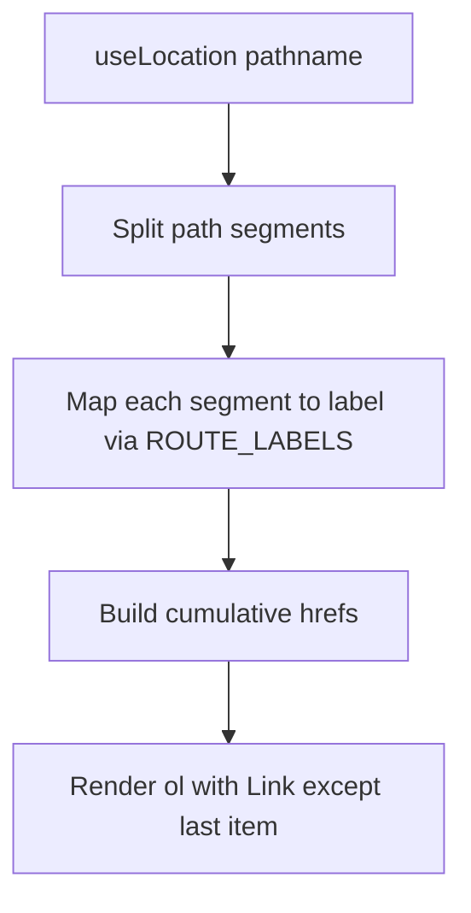

# Action Plan 05 — UX Flow & Breadcrumbs

## 1. Goal

Audit the SarradaBet SPA route map, fix navigation dead ends and orphan pages, add a catch-all 404 route, and implement a dynamic `Breadcrumb` component for main and admin layouts.

## 2. Market Research / Requirements

Not applicable — internal UX improvement. Current routing uses **react-router v8** in [`App.tsx`](../../apps/web/src/App.tsx), not Next.js `next/router`.

### Current route inventory

| Path | Page | Nav reachable | Notes |
|------|------|---------------|-------|
| `/` | HomePage | Yes (logo) | OK |
| `/login`, `/register` | Auth pages | Yes | Standalone layout (no main nav) |
| `/profile`, `/dashboard`, `/coins` | User pages | Yes (auth nav) | OK |
| `/leaderboard`, `/rewards` | Public pages | Yes | OK |
| `/tickets/verify/:code` | TicketVerifyPage | **No** (QR/deep link only) | Intentional orphan |
| `/admin/login` | AdminLogin | **No** (URL/redirect only) | Intentional |
| `/admin/*` | Admin panel | Admin nav only | OK for admins |
| `*` (404) | **Missing** | — | Add NotFoundPage |

## 3. Tech Stack & Dependencies

| Item | Purpose |
|------|---------|
| `react-router` v8 | `useLocation`, `useMatches`, `Link`, `Route path="*"` |
| `Breadcrumb` component | Dynamic trail from route config |
| Route label map | `apps/web/src/routes/routeLabels.ts` |
| `NotFoundPage` | Catch-all 404 |
| Vitest + RTL | Crumb builder unit tests |
| `cursor-ide-browser` | Manual navigation audit |

## 4. MCPs to Utilize

| MCP | Cursor mapping | When to use |
|-----|----------------|-------------|
| `@modelcontextprotocol/server-filesystem` | Built-in Read/Write | Routes, breadcrumb, 404, tests, layout wiring |
| `@modelcontextprotocol/server-git` | Shell `git` | Branch `feature/breadcrumbs-ux-audit` |
| `@modelcontextprotocol/server-browser` | `cursor-ide-browser` | Click-through audit of all routes |

## 5. Engineering Rules

### TDD

- Write failing unit tests for `buildBreadcrumbs(pathname, params)` before component.
- Write failing RTL test: `/admin/bets` renders `Início > Admin > Apostas`.
- Write failing test: unknown path renders 404 page.

### Clean Code

- Pure function `buildBreadcrumbs()` — no side effects; easy to test.
- Route labels in one config object; no magic strings in component.
- Keep audit findings as checklist in this doc, not scattered comments.

### Design Patterns

- **Pure function** for path → segment mapping.
- **Composition**: `<Breadcrumb />` in page shell and `AdminLayout`.
- **Configuration over convention**: explicit label map for ambiguous segments.

### Best Practices

- Breadcrumb links use `<Link>` (client-side navigation), not `<a href>`.
- Last crumb is not a link (current page).
- Accessible: `<nav aria-label="Breadcrumb">` + ordered list.
- Run `npm run lint`, `npm run check-types`, `npm run test:web`.

## 6. Step-by-Step Implementation Checklist

### Phase A — Route audit (document findings)

- [ ] **MCP: filesystem** — Read full [`App.tsx`](../../apps/web/src/App.tsx) route tree.
- [ ] **MCP: browser** — Navigate each route; record dead ends:

| Issue | Fix |
|-------|-----|
| No 404 route | Add `path="*"` → `NotFoundPage` |
| Ticket verify has no back link | Add "Voltar ao início" link |
| Admin login isolated | Add "← Voltar para o site" (may already exist) |
| Login/Register no nav to Home | Ensure logo links to `/` |
| Protected routes when logged out | Verify redirect to `/login` (existing `ProtectedRoute`) |

- [ ] **MCP: filesystem** — Document audit results in PR description or update this checklist when executing.

### Phase B — Breadcrumb infrastructure (TDD)

- [ ] **MCP: git** — Branch `feature/breadcrumbs-ux-audit`.
- [ ] **MCP: filesystem** — Create `apps/web/src/routes/routeLabels.ts`:

```typescript
export const ROUTE_LABELS: Record<string, string> = {
  "": "Início",
  admin: "Admin",
  dashboard: "Painel",
  bets: "Apostas",
  categories: "Categorias",
  "coin-packages": "Pacotes de moedas",
  users: "Usuários",
  rewards: "Recompensas",
  coins: "Moedas",
  profile: "Perfil",
  dashboard: "Dashboard",
  leaderboard: "Ranking",
  rewards: "Recompensas",
  login: "Entrar",
  register: "Cadastrar",
  tickets: "Ingressos",
  verify: "Verificar",
};
```

- [ ] **Write test first**: `apps/web/src/components/navigation/__tests__/buildBreadcrumbs.test.ts`.
- [ ] **MCP: filesystem** — Create `apps/web/src/components/navigation/buildBreadcrumbs.ts`.
- [ ] **Write test first**: `Breadcrumb.test.tsx`.
- [ ] **MCP: filesystem** — Create `apps/web/src/components/navigation/Breadcrumb.tsx`.

### Phase C — Integration & fixes

- [ ] **MCP: filesystem** — Create `apps/web/src/pages/NotFoundPage.tsx` (PT copy: "Página não encontrada", link to `/`).
- [ ] **MCP: filesystem** — Add `<Route path="*" element={<NotFoundPage />} />` to `App.tsx`.
- [ ] **MCP: filesystem** — Add `<Breadcrumb />` to pages with main `Navigation` (or shared `PageShell` wrapper).
- [ ] **MCP: filesystem** — Add `<Breadcrumb />` to [`AdminLayout.tsx`](../../apps/web/src/components/admin/AdminLayout.tsx) below header.
- [ ] **MCP: filesystem** — Add back link to [`TicketVerifyPage.tsx`](../../apps/web/src/pages/TicketVerifyPage.tsx).
- [ ] **MCP: browser** — Re-run full navigation audit.

### Phase D — Verification

- [ ] Run tests → green.
- [ ] Run `npm run lint`, `npm run check-types`, `npm run test:web`.

## 7. UI/UX Implementation Details

### Audit process

1. **Map routes** — Export route tree from `App.tsx` into a table (path, auth, nav link, back target).
2. **Identify orphans** — Pages with no inbound nav link (except intentional deep links).
3. **Test back navigation** — Browser back button should not trap users; each page has explicit exit (nav, breadcrumb, or back link).
4. **Protected flow** — Logged-out user hitting `/coins` → `/login` with return URL (optional enhancement).
5. **Admin isolation** — "Ver Site" in admin header returns to `/`.

### Breadcrumb component logic



Rules:
- Skip empty segments from split.
- Dynamic params (`:code`) → use param value or generic label "Detalhe".
- Admin paths prefix with `Admin` crumb linking to `/admin/dashboard`.
- Hide breadcrumb on Home (`/`) or show single "Início" only — team preference: hide on `/`.

### Visual design

- Separator: `/` or `›`
- Muted intermediate links; current page bold, no link
- Mobile: truncate middle segments if >3 levels (`Início › … › Apostas`)

## 8. Code Snippets / Pseudo-code

### buildBreadcrumbs.ts

```typescript
export interface BreadcrumbItem {
  label: string;
  href?: string;
}

export function buildBreadcrumbs(pathname: string): BreadcrumbItem[] {
  const segments = pathname.split("/").filter(Boolean);
  if (segments.length === 0) return [{ label: "Início" }];

  const items: BreadcrumbItem[] = [{ label: "Início", href: "/" }];
  let path = "";

  for (const segment of segments) {
    path += `/${segment}`;
    const label = ROUTE_LABELS[segment] ?? segment;
    items.push({
      label,
      href: path === pathname ? undefined : path,
    });
  }

  // Last item: no href (current page)
  items[items.length - 1].href = undefined;
  return items;
}
```

### Breadcrumb.tsx

```tsx
import { Link, useLocation } from "react-router";
import { buildBreadcrumbs } from "./buildBreadcrumbs";

export function Breadcrumb() {
  const { pathname } = useLocation();
  if (pathname === "/") return null;

  const items = buildBreadcrumbs(pathname);

  return (
    <nav aria-label="Breadcrumb" className="breadcrumb">
      <ol>
        {items.map((item, i) => (
          <li key={i}>
            {item.href ? <Link to={item.href}>{item.label}</Link> : <span aria-current="page">{item.label}</span>}
            {i < items.length - 1 && <span aria-hidden="true"> › </span>}
          </li>
        ))}
      </ol>
    </nav>
  );
}
```

### NotFoundPage.tsx

```tsx
export default function NotFoundPage() {
  return (
    <div>
      <h1>Página não encontrada</h1>
      <p>A página que você procura não existe.</p>
      <Link to="/">Voltar ao início</Link>
    </div>
  );
}
```

## 9. Testing & Success Criteria

### Automated

- [ ] `buildBreadcrumbs("/admin/bets")` → `[Início, Admin, Apostas]`.
- [ ] `buildBreadcrumbs("/coins")` → `[Início, Moedas]`.
- [ ] Last crumb has no `href`.
- [ ] Unknown route renders `NotFoundPage`.
- [ ] `npm run lint`, `npm run check-types` clean.

### Manual browser audit (MCP: browser)

- [ ] Every nav link reaches expected page.
- [ ] `/invalid-path` shows 404 with home link.
- [ ] Breadcrumbs correct on Admin Bets, Coins, Profile.
- [ ] Ticket verify page has exit link.
- [ ] Browser back works across Login → Home → Leaderboard.
- [ ] No page lacks any navigation escape except intentional modals.

### Success criteria

UX flow complete when 404 exists, breadcrumbs render on nested routes, audit issues fixed, and navigation is reachable from all non-modal screens.
