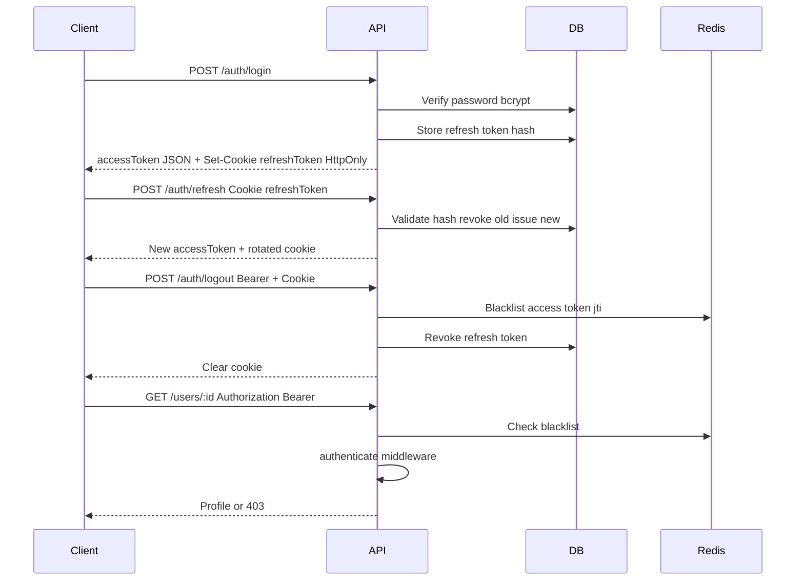

# Feature 01 — User Authentication and CRUD

**Status:** Complete

## Prompt summary

Build user authentication with registration (email, username, password) and login that issues a short-lived access token (JWT) plus a refresh token stored in an HttpOnly cookie. Support token refresh with rotation and logout. Implement user CRUD (list, view, edit, delete) with RBAC: admins manage all users; regular users can only view/edit their own profile. Protect routes with auth middleware — especially bet creation. Use bcrypt for password hashing and Zod for validation.

## Current state in SarradaBet

### Database

- `User` model with `username`, `email`, `phone`, `passwordHash`, `role`, `coinBalance` — [`apps/api/prisma/schema.prisma`](../../apps/api/prisma/schema.prisma)
- `RefreshToken` model with `tokenHash`, `expiresAt`, `revokedAt`, `replacedByTokenId` (rotation chain)
- `UserRole` enum: `USER`, `ADMIN`

### Backend

| Component | Path |
|-----------|------|
| Auth service (register, login, refresh, logout) | [`apps/api/src/modules/auth/services/AuthService.ts`](../../apps/api/src/modules/auth/services/AuthService.ts) |
| Auth routes | [`apps/api/src/modules/auth/routes/auth.routes.ts`](../../apps/api/src/modules/auth/routes/auth.routes.ts) |
| Auth controller | [`apps/api/src/modules/auth/controllers/AuthController.ts`](../../apps/api/src/modules/auth/controllers/AuthController.ts) |
| Auth middleware | [`apps/api/src/core/middleware/AuthMiddleware.ts`](../../apps/api/src/core/middleware/AuthMiddleware.ts) |
| Token blacklist (Redis) | [`apps/api/src/services/TokenBlacklistService.ts`](../../apps/api/src/services/TokenBlacklistService.ts) |
| User CRUD | [`apps/api/src/modules/user/`](../../apps/api/src/modules/user/) |
| Password/token utils | [`apps/api/src/utils/auth.ts`](../../apps/api/src/utils/auth.ts) |
| Optional external identity | [`apps/api/src/services/identityService.client.ts`](../../apps/api/src/services/identityService.client.ts) (`USE_IDENTITY_SERVICE=true`) |

### Environment

From [`apps/api/src/config/env.ts`](../../apps/api/src/config/env.ts):

- `JWT_SECRET`, `JWT_ACCESS_EXPIRES_IN` (default `15m`), `JWT_REFRESH_EXPIRES_IN` (default `7d`)
- `REFRESH_TOKEN_COOKIE_NAME` (default `refreshToken`)
- `REDIS_URL` (default `redis://localhost:6379`)
- `AUTH_LOGIN_RATE_LIMIT_MAX` (default `10`)
- `AUTH_REGISTER_RATE_LIMIT_MAX` (default `5`)

### Frontend

- Auth context: [`apps/web/src/context/AuthProvider.tsx`](../../apps/web/src/context/AuthProvider.tsx), [`apps/web/src/hooks/useAuth.ts`](../../apps/web/src/hooks/useAuth.ts)
- Shared API client: [`apps/web/src/services/apiClient.ts`](../../apps/web/src/services/apiClient.ts)
- Registration: [`apps/web/src/pages/RegisterPage.tsx`](../../apps/web/src/pages/RegisterPage.tsx)
- Login: [`apps/web/src/pages/LoginPage.tsx`](../../apps/web/src/pages/LoginPage.tsx)
- Profile (read-only): [`apps/web/src/pages/ProfilePage.tsx`](../../apps/web/src/pages/ProfilePage.tsx)
- Admin login: [`apps/web/src/pages/AdminLogin.tsx`](../../apps/web/src/pages/AdminLogin.tsx)
- Admin users: [`apps/web/src/pages/AdminUsersPage.tsx`](../../apps/web/src/pages/AdminUsersPage.tsx)
- Protected routes: [`apps/web/src/components/ProtectedRoute.tsx`](../../apps/web/src/components/ProtectedRoute.tsx)
- Navigation auth UI: [`apps/web/src/components/Navigation.tsx`](../../apps/web/src/components/Navigation.tsx)
- Admin auth hook: [`apps/web/src/hooks/useAdminAuth.ts`](../../apps/web/src/hooks/useAdminAuth.ts) (wraps `useAuth`)

### API documentation

Auth endpoints documented in [`docs/API.md`](../API.md#authentication).

### Tests

- [`apps/api/src/__tests__/integration/auth.routes.test.ts`](../../apps/api/src/__tests__/integration/auth.routes.test.ts)
- [`apps/web/src/hooks/__tests__/useAuth.test.tsx`](../../apps/web/src/hooks/__tests__/useAuth.test.tsx)
- [`apps/web/src/components/__tests__/ProtectedRoute.test.tsx`](../../apps/web/src/components/__tests__/ProtectedRoute.test.tsx)

## Auth flow (current)



## Remaining gaps (out of scope)

- **Voting is anonymous** — `Vote` model has no `userId`; public vote endpoints do not require auth (Feature 03)
- **Phone required on register** — prompt mentions email/username/password; codebase also requires `phone` (unique)
- **Protected bet creation** — `POST /bets` requires auth (done); broader "all betting actions require login" is not done because votes are public

## Implementation checklist

### Backend

- [x] Register with bcrypt hash
- [x] Login with access + refresh token
- [x] Refresh with rotation (`replacedByTokenId`)
- [x] Logout revokes refresh token
- [x] User CRUD with self/admin RBAC
- [x] `authenticate` middleware on `POST /bets`
- [x] Redis access-token blacklist on logout
- [x] Rate limit login/register endpoints

### Frontend

- [x] Add global auth context (access token in memory, refresh via cookie)
- [x] Wire auth state to sportsbook header (login/logout, profile link)
- [x] Redirect unauthenticated users from protected pages
- [x] Share auth hook between admin and end-user flows where appropriate
- [x] Read-only profile page
- [x] Admin users list/delete UI

## Acceptance criteria

- [x] User can register, login, refresh, logout; refresh cookie is HttpOnly and rotates on refresh
- [x] Admin can list/delete any user; user can only GET/PUT own profile
- [x] Unauthenticated `POST /bets` returns 401
- [x] Invalid/expired refresh token returns 401 and clears cookie
- [x] Integration tests in `auth.routes.test.ts` pass
- [x] Blacklisted access token rejected after logout
- [x] Auth login/register rate limits return 429

## Test plan

| Test file | Coverage |
|-----------|----------|
| [`auth.routes.test.ts`](../../apps/api/src/__tests__/integration/auth.routes.test.ts) | Register, login, refresh rotation, logout, `/me`, DELETE, RBAC, blacklist, rate limit |
| [`useAuth.test.tsx`](../../apps/web/src/hooks/__tests__/useAuth.test.tsx) | Boot refresh, login, logout |
| [`ProtectedRoute.test.tsx`](../../apps/web/src/components/__tests__/ProtectedRoute.test.tsx) | Redirect + loading states |

Run:

```bash
npm run test --workspace=apps/api -- auth.routes
npm run test --workspace=apps/web -- useAuth ProtectedRoute
```
