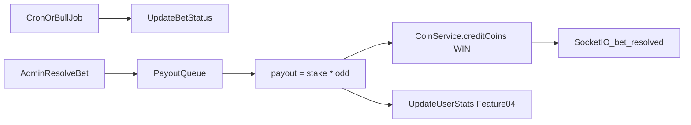

# Feature 03 — Bet Closure and Payout

**Status:** Planned

## Prompt summary

Add match/bet status fields (`scheduled`, `live`, `finished`) and/or closing datetime. In the bet creation service, validate that the bet is still open (`scheduled` status and `start_time` in the future). Create a scheduled job (Bull or node-cron) to auto-update bet statuses. After a bet finishes, resolve wagers: calculate winnings (`amount * odd`), credit the user, and record a `win` transaction. Process payouts in batch via queues with Prisma transactions for consistency.

## Current state in SarradaBet

### What exists

| Capability | Path / detail |
|------------|---------------|
| Bet status enum | `open`, `closed`, `resolved` — no `scheduled`/`live`/`finished` |
| Manual close | `BetService.closeBet()` — [`BetService.ts`](../../apps/api/src/modules/bet/services/BetService.ts) |
| Manual resolve | `BetService.resolveBet(id, winningOddId)` — marks odds `won`/`lost`, sets `resolvedAt` |
| Anonymous votes | `Vote` model — no `userId`, no stake amount |
| Odd values | `Float` on `Odd.value` |
| Realtime | `bet:updated` on resolve — [`realtime.ts`](../../packages/types/src/realtime.ts) |
| Admin UI | [`ResolveBetModal.tsx`](../../apps/web/src/components/admin/ResolveBetModal.tsx) |

### What is missing

- No `startTime` / `closesAt` on `Bet`
- No automatic status transitions (cron/Bull)
- Votes are not tied to users or coin stakes
- `resolveBet` does **not** credit coins or create `CoinTransaction`
- No `WIN` source in `CoinTransactionSource`
- No payout queue for batch processing

## Recommended technical references

| Topic | Reference |
|-------|-----------|
| Scheduled jobs | [`Bull`](https://github.com/OptimalBits/bull) + Redis, or [`node-cron`](https://www.npmjs.com/package/node-cron) for simpler schedules |
| Atomic payout | Prisma `$transaction` — reuse [`CoinService.creditCoins`](../../apps/api/src/modules/coin/services/CoinService.ts) |
| Decimal math | Prisma `Decimal` for odds and payout amounts (avoid float rounding) |
| Batch processing | Bull queue: `payout:resolve-bet` job per bet or per batch of winning votes |
| Events | New Socket.io event e.g. `bet:resolved` with user payout summary |

## Proposed schema / API changes

### Prisma schema

```prisma
enum BetStatus {
  scheduled   // new — accepting bets, start_time in future
  open        // live — accepting bets
  closed      // no new bets, awaiting result
  resolved    // outcome set, payouts processed
}

model Bet {
  startTime   DateTime? @map("start_time")
  closesAt    DateTime? @map("closes_at")
  // existing fields...
}

model Vote {
  userId    Int      @map("user_id")
  amount    Int      // coins staked
  user      User     @relation(fields: [userId], references: [id])
  @@unique([userId, oddId]) // one stake per odd per user
}

enum CoinTransactionSource {
  // existing...
  WIN
  BET_COST   // debit on vote — wire here
}
```

Consider migrating `Odd.value` from `Float` to `Decimal`.

### New / updated API

| Method | Route | Description |
|--------|-------|-------------|
| POST | `/api/v1/votes` | Require auth; debit `BET_COST`; link `userId` |
| POST | `/api/v1/bets` | Validate `status === scheduled` and `startTime > now` |
| — | Background job | `scheduled → open` at `startTime`; `open → closed` at `closesAt` |
| — | On `resolveBet` | Enqueue payout jobs for winning votes |

### Socket.io

```typescript
// packages/types/src/realtime.ts — proposed
bet:resolved → { betId, winningOddId, payouts: { userId, amount, newBalance }[] }
```

## Payout flow (proposed)



## Implementation checklist

### Phase 1 — Schema and validation

- [ ] Add `startTime`, `closesAt` to `Bet`; extend `BetStatus` or map prompt statuses to existing enum
- [ ] Add `userId`, `amount` to `Vote`; unique constraint per user/odd
- [ ] Add `WIN` to `CoinTransactionSource`
- [ ] Migration + update seed data

### Phase 2 — Authenticated betting

- [ ] Require auth on `POST /votes`
- [ ] Debit coins via `CoinService.debitCoins` with `BET_COST` before creating vote
- [ ] Validate bet is `open` (or `scheduled` with future `startTime`)
- [ ] Refund on bet cancellation (optional `REFUND` source)

### Phase 3 — Scheduled jobs

- [ ] Install Bull + Redis or node-cron
- [ ] Job: transition `scheduled → open` when `startTime <= now`
- [ ] Job: transition `open → closed` when `closesAt <= now`
- [ ] Register jobs in [`server.ts`](../../apps/api/src/server.ts) bootstrap

### Phase 4 — Payout

- [ ] Extend `resolveBet` to enqueue payout work (don't block HTTP on large batches)
- [ ] Payout worker: for each vote on winning odd, `creditCoins(stake * oddValue, WIN)`
- [ ] Use `$transaction` per user payout; handle partial failures with retry
- [ ] Emit `bet:resolved` per user or batch notification
- [ ] Hook into user stats update (Feature 04)

### Phase 5 — Frontend

- [ ] Sportsbook: require login to vote; show stake/cost
- [ ] Admin: set `startTime`/`closesAt` on bet create/edit
- [ ] Display bet lifecycle status to users

## Key files

| Path | Action |
|------|--------|
| [`apps/api/prisma/schema.prisma`](../../apps/api/prisma/schema.prisma) | **extend** |
| [`BetService.ts`](../../apps/api/src/modules/bet/services/BetService.ts) | **extend** — validation, enqueue payout |
| [`vote.service.ts`](../../apps/api/src/services/vote.service.ts) | **extend** — auth, debit, userId |
| [`vote.routes.ts`](../../apps/api/src/routes/vote.routes.ts) | **wire** — `authenticateUser` |
| [`CoinService.ts`](../../apps/api/src/modules/coin/services/CoinService.ts) | **extend** — `WIN` credits |
| `apps/api/src/jobs/` | **create** — cron/Bull workers |
| [`packages/types/src/realtime.ts`](../../packages/types/src/realtime.ts) | **extend** |
| [`HomePage.tsx`](../../apps/web/src/pages/HomePage.tsx) | **wire** — authenticated voting |

## Acceptance criteria

- [ ] Cannot vote on `closed` or `resolved` bets
- [ ] Cannot vote without sufficient coin balance; `BET_COST` transaction recorded
- [ ] Bets auto-transition status via scheduled job
- [ ] On resolve, every winning vote receives `stake * odd` coins atomically
- [ ] Losing votes receive no credit; no double payout on re-run (idempotent by vote id)
- [ ] Users notified via Socket.io when their bet wins

## Dependencies

- [Feature 01 — User auth](./01-user-auth-and-crud.md) — authenticated votes
- [Feature 02 — Coins](./02-coins-and-pix-payments.md) — `CoinService` debit/credit

## Test plan

| Test | Coverage |
|------|----------|
| Extend `BetService.test.ts` | Status validation, resolve enqueues payout |
| New `payout.worker.test.ts` | Win calculation, idempotency, insufficient pool edge cases |
| Integration `vote.routes.test.ts` | Auth required, balance debit, closed bet rejected |
| Integration payout E2E | Resolve bet → balance increases for winners only |

Run: `npm run test --workspace=apps/api`
