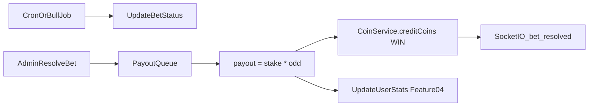

# Feature 03 — Bet Closure and Payout

**Status:** Done (parimutuel payout model; Feature 04 stats hook deferred)

## Prompt summary

Add match/bet status fields (`scheduled`, `live`, `finished`) and/or closing datetime. In the bet creation service, validate that the bet is still open (`scheduled` status and `start_time` in the future). Create a scheduled job (Bull or node-cron) to auto-update bet statuses. After a bet finishes, resolve wagers: calculate winnings (`amount * odd`), credit the user, and record a `win` transaction. Process payouts in batch via queues with Prisma transactions for consistency.

## Current state in SarradaBet

### What exists

| Capability | Path / detail |
|------------|---------------|
| Bet status enum | `open`, `closed`, `resolved` — no `scheduled`/`live`/`finished` |
| Manual close | `BetService.closeBet()` — [`BetService.ts`](../../apps/api/src/modules/bet/services/BetService.ts) |
| Manual resolve | `BetService.resolveBet(id, winningOddId)` — marks odds `won`/`lost`, sets `resolvedAt` |
| Anonymous votes | `Vote` model — no `userId`, no stake amount |
| Odd values | `Float` on `Odd.value` |
| Realtime | `bet:updated` on resolve — [`realtime.ts`](../../packages/types/src/realtime.ts) |
| Admin UI | [`ResolveBetModal.tsx`](../../apps/web/src/components/admin/ResolveBetModal.tsx) |

### What is missing

- No `startTime` / `closesAt` on `Bet`
- No automatic status transitions (cron/Bull)
- Votes are not tied to users or coin stakes
- `resolveBet` does **not** credit coins or create `CoinTransaction`
- No `WIN` source in `CoinTransactionSource`
- No payout queue for batch processing

## Recommended technical references

| Topic | Reference |
|-------|-----------|
| Scheduled jobs | [`Bull`](https://github.com/OptimalBits/bull) + Redis, or [`node-cron`](https://www.npmjs.com/package/node-cron) for simpler schedules |
| Atomic payout | Prisma `$transaction` — reuse [`CoinService.creditCoins`](../../apps/api/src/modules/coin/services/CoinService.ts) |
| Decimal math | Prisma `Decimal` for odds and payout amounts (avoid float rounding) |
| Batch processing | Bull queue: `payout:resolve-bet` job per bet or per batch of winning votes |
| Events | New Socket.io event e.g. `bet:resolved` with user payout summary |

## Proposed schema / API changes

### Prisma schema

```prisma
enum BetStatus {
  scheduled   // new — accepting bets, start_time in future
  open        // live — accepting bets
  closed      // no new bets, awaiting result
  resolved    // outcome set, payouts processed
}

model Bet {
  startTime   DateTime? @map("start_time")
  closesAt    DateTime? @map("closes_at")
  // existing fields...
}

model Vote {
  userId    Int      @map("user_id")
  amount    Int      // coins staked
  user      User     @relation(fields: [userId], references: [id])
  @@unique([userId, oddId]) // one stake per odd per user
}

enum CoinTransactionSource {
  // existing...
  WIN
  BET_COST   // debit on vote — wire here
}
```

Consider migrating `Odd.value` from `Float` to `Decimal`.

### New / updated API

| Method | Route | Description |
|--------|-------|-------------|
| POST | `/api/v1/votes` | Require auth; debit `BET_COST`; link `userId` |
| POST | `/api/v1/bets` | Validate `status === scheduled` and `startTime > now` |
| — | Background job | `scheduled → open` at `startTime`; `open → closed` at `closesAt` |
| — | On `resolveBet` | Enqueue payout jobs for winning votes |

### Socket.io

```typescript
// packages/types/src/realtime.ts — proposed
bet:resolved → { betId, winningOddId, payouts: { userId, amount, newBalance }[] }
```

## Payout flow (proposed)


```mermaid
flowchart LR
  cronJob[CronOrBullJob] --> updateStatus[UpdateBetStatus]
  adminResolve[AdminResolveBet] --> payoutQueue[PayoutQueue]
  payoutQueue --> calcWin["payout = stake * odd"]
  calcWin --> coinTx[CoinService.creditCoins WIN]
  coinTx --> notifyUser[SocketIO_bet_resolved]
  calcWin --> statsHook[UpdateUserStats Feature04]
```

## Gherkin Specifications (BDD)

Os seguintes cenários Gherkin definem o comportamento esperado para o encerramento de apostas, votação e fluxos de pagamento. Eles devem ser implementados como testes E2E executáveis usando Playwright + Cucumber.

```gherkin
Funcionalidade: Encerramento de Apostas e Pagamento de Prêmios
  Como um usuário e um administrador
  Eu quero votar em apostas, ter transições automáticas de status e receber prêmios
  Para que o ciclo de vida da aposta seja totalmente automatizado e transparente

  Contexto:
    Dado que um usuário "Jogador" tem saldo de moedas de "1000"
    E um usuário administrador "Admin" está autenticado
    E uma aposta "Jogo 1" existe com:
      | campo       | valor                  |
      | status      | open                   |
      | startTime   | 2026-07-01T10:00:00Z   |
      | closesAt    | 2026-07-01T12:00:00Z   |
    E a aposta "Jogo 1" tem uma odd "2.0" com id "odd-1"

  # --- VOTAÇÃO ---

  @smoke @auth
  Cenário: Usuário vota com sucesso em uma aposta aberta
    Quando o usuário vota "100" moedas na odd "odd-1" da aposta "Jogo 1"
    Então o voto é criado com valor "100" e userId "Jogador"
    E o saldo de moedas do usuário diminui em "100" para "900"
    E uma transação "BET_COST" é registrada com valor "-100"
    E o voto é vinculado ao usuário autenticado

  @smoke @validation
  Cenário: Usuário não consegue votar em uma aposta fechada
    Dado que uma aposta "Jogo Antigo" existe com status "closed"
    Quando o usuário tenta votar "100" moedas no "Jogo Antigo"
    Então o sistema rejeita a requisição com erro "Aposta está fechada"
    E o saldo de moedas do usuário permanece inalterado

  @smoke @validation
  Cenário: Usuário não consegue votar com saldo insuficiente
    Dado que uma aposta "Jogo 2" existe com status "open"
    Quando o usuário tenta votar "2000" moedas no "Jogo 2"
    Então o sistema rejeita a requisição com erro "Saldo insuficiente"
    E nenhum voto é criado

  @validation
  Cenário: Usuário pode fazer múltiplos tickets na mesma odd e cobrir vários outcomes
    Dado que o usuário já possui um voto de "50" moedas na odd "Team A"
    Quando o usuário vota "100" moedas na mesma odd "Team A"
    E vota "75" moedas na odd "Team B" do mesmo mercado
    Então ambos os votos adicionais são registrados
    E o saldo do usuário é debitado pelo total apostado

  # --- TRANSIÇÕES DE STATUS AGENDADAS ---

  @smoke @job
  Cenário: Job agendado transiciona apostas de scheduled para open
    Dado que uma aposta "Jogo Futuro" existe com status "scheduled"
      E seu startTime está no passado
    Quando o job de status agendado é executado
    Então o status da aposta "Jogo Futuro" atualiza para "open"

  @smoke @job
  Cenário: Job agendado transiciona apostas de open para closed
    Dado que uma aposta "Jogo Ao Vivo" existe com status "open"
      E seu closesAt está no passado
    Quando o job de status agendado é executado
    Então o status da aposta "Jogo Ao Vivo" atualiza para "closed"

  @job
  Cenário: Job agendado não transiciona apostas com horários futuros
    Dado que uma aposta "Jogo Posterior" existe com status "scheduled"
      E seu startTime está no futuro
    Quando o job de status agendado é executado
    Então o status da aposta "Jogo Posterior" permanece "scheduled"

  # --- RESOLUÇÃO ADMINISTRATIVA E FILA DE PAGAMENTOS ---

  @smoke @admin
  Cenário: Administrador resolve uma aposta e enfileira jobs de pagamento
    Dado que a aposta "Jogo 1" possui "3" votos na odd "odd-1"
      E a aposta "Jogo 1" possui "2" votos em outras odds
    Quando o administrador resolve a aposta "Jogo 1" com a odd vencedora "odd-1"
    Então o status da aposta atualiza para "resolved"
    E exatamente "3" jobs de pagamento são enfileirados para os votos vencedores
    E a operação de resolução retorna HTTP 200 antes de todos os pagamentos terminarem

  @smoke @worker
  Cenário: Worker de pagamento credita moedas aos votantes vencedores
    Dado que um job de pagamento para o usuário "Jogador" existe com:
      | aposta | odd  |
      | 100    | 2.0  |
    Quando o worker de pagamento processa o job
    Então o usuário "Jogador" recebe "200" moedas
    E o saldo do usuário aumenta de "900" para "1100"
    E uma transação "WIN" é registrada com valor "+200"
    E o status do voto é atualizado para "paid"

  @worker
  Cenário: Worker de pagamento NÃO credita votantes perdedores
    Dado que existe um voto em uma odd perdedora para o usuário "Jogador" com aposta "100"
    Quando o worker de pagamento processa o voto perdedor
    Então o usuário "Jogador" não recebe nenhuma moeda
    E nenhuma transação "WIN" é criada para esse voto

  @worker @idempotency
  Cenário: Worker de pagamento é idempotente e não paga em dobro
    Dado que um voto vencedor já foi processado e marcado como "paid"
    Quando o worker de pagamento processa o mesmo job novamente
    Então o saldo do usuário não aumenta
    E nenhuma transação "WIN" duplicada é registrada
    E o sistema registra um aviso para "tentativa de pagamento duplicado"

  # --- NOTIFICAÇÕES EM TEMPO REAL ---

  @smoke @realtime
  Cenário: Usuário recebe notificação via socket ao ganhar um pagamento
    Dado que o worker de pagamento creditou "200" moedas para "Jogador"
    Quando o worker finaliza o processamento
    Então um evento socket "bet:resolved" é emitido para o usuário "Jogador"
    E o payload do evento contém:
      | campo        | valor       |
      | betId        | Jogo 1      |
      | amount       | 200         |
      | newBalance   | 1100        |
      | winningOddId | odd-1       |

  @realtime
  Cenário: Notificação não é enviada para usuários sem votos vencedores
    Dado que um usuário "Perdedor" tinha um voto em uma odd perdedora
    Quando a aposta "Jogo 1" é resolvida
    Então nenhum evento "bet:resolved" é emitido para o usuário "Perdedor"

  # --- CASOS DE BORDA ---

  @edge
  Cenário: Pagamento lida com odds decimais corretamente sem erros de ponto flutuante
    Dado que um voto vencedor com aposta "10" e odd "1.33" existe
    Quando o worker de pagamento processa o job
    Então o valor creditado é exatamente "13.3" (usando precisão Decimal)
    E o registro da transação armazena "13.3"

  @edge
  Cenário: Administrador não pode resolver uma aposta já resolvida
    Dado que a aposta "Jogo 1" possui status "resolved"
    Quando o administrador tenta resolver a aposta "Jogo 1" novamente
    Então o sistema rejeita a requisição com erro "Aposta já foi resolvida"
```

## Implementation checklist

### Phase 1 — Schema and validation

- [x] Add `startTime`, `closesAt` to `Bet`; extend `BetStatus` or map prompt statuses to existing enum
- [x] Add `userId`, `amount` to `Vote`; unique constraint per user/odd
- [x] Add `WIN` to `CoinTransactionSource`
- [x] Migration + update seed data

### Phase 2 — Authenticated betting

- [x] Require auth on `POST /votes`
- [x] Debit coins via `CoinService.debitCoins` with `BET_COST` before creating vote
- [x] Validate bet is `open` (or `scheduled` with future `startTime`)
- [ ] Refund on bet cancellation (optional `REFUND` source) — deferred

### Phase 3 — Scheduled jobs

- [x] Install Bull + Redis or node-cron
- [x] Job: transition `scheduled → open` when `startTime <= now`
- [x] Job: transition `open → closed` when `closesAt <= now`
- [x] Register jobs in [`server.ts`](../../apps/api/src/server.ts) bootstrap

### Phase 4 — Payout

- [x] Extend `resolveBet` to enqueue payout work (don't block HTTP on large batches)
- [x] Payout worker: parimutuel `calculatePayout(stake, pool, winningPool)` with 25% takeout (`BET_TAKEOUT_RATE`)
- [x] Use `$transaction` per user payout; handle partial failures with retry
- [x] Emit `bet:resolved` per user or batch notification
- [ ] Hook into user stats update (Feature 04) — deferred

### Phase 5 — Frontend

- [x] Sportsbook: require login to vote; show stake/cost
- [x] Admin: set `startTime`/`closesAt` on bet create/edit
- [x] Display bet lifecycle status to users

## Key files

| Path | Action |
|------|--------|
| [`apps/api/prisma/schema.prisma`](../../apps/api/prisma/schema.prisma) | **extend** |
| [`BetService.ts`](../../apps/api/src/modules/bet/services/BetService.ts) | **extend** — validation, enqueue payout |
| [`vote.service.ts`](../../apps/api/src/services/vote.service.ts) | **extend** — auth, debit, userId |
| [`vote.routes.ts`](../../apps/api/src/routes/vote.routes.ts) | **wire** — `authenticateUser` |
| [`CoinService.ts`](../../apps/api/src/modules/coin/services/CoinService.ts) | **extend** — `WIN` credits |
| `apps/api/src/jobs/` | **create** — cron/Bull workers |
| [`packages/types/src/realtime.ts`](../../packages/types/src/realtime.ts) | **extend** |
| [`HomePage.tsx`](../../apps/web/src/pages/HomePage.tsx) | **wire** — authenticated voting |

## Acceptance criteria

- [x] Cannot vote on `closed` or `resolved` bets
- [x] Cannot vote without sufficient coin balance; `BET_COST` transaction recorded
- [x] Bets auto-transition status via scheduled job
- [x] On resolve, every winning vote receives parimutuel payout coins atomically
- [x] Losing votes receive no credit; no double payout on re-run (idempotent by vote id)
- [x] Users notified via Socket.io when their bet wins (toast + balance refresh)

## Dependencies

- [Feature 01 — User auth](./01-user-auth-and-crud.md) — authenticated votes
- [Feature 02 — Coins](./02-coins-and-pix-payments.md) — `CoinService` debit/credit

## Test plan

| Test | Coverage | Status |
|------|----------|--------|
| Extend `BetService.test.ts` | Status validation, resolve enqueues payout | Done |
| New `payout.worker.test.ts` | Parimutuel payout math, floor rounding | Done |
| Integration `bet.routes.test.ts` | Auth, balance debit, closed bet, insufficient balance, multi-ticket votes, status job | Done |
| E2E `encerramento-pagamento.feature` | Vote, payout, resolve guard, status job | Done |

Run: `npm run test:api` · `npm run test:e2e:smoke`
