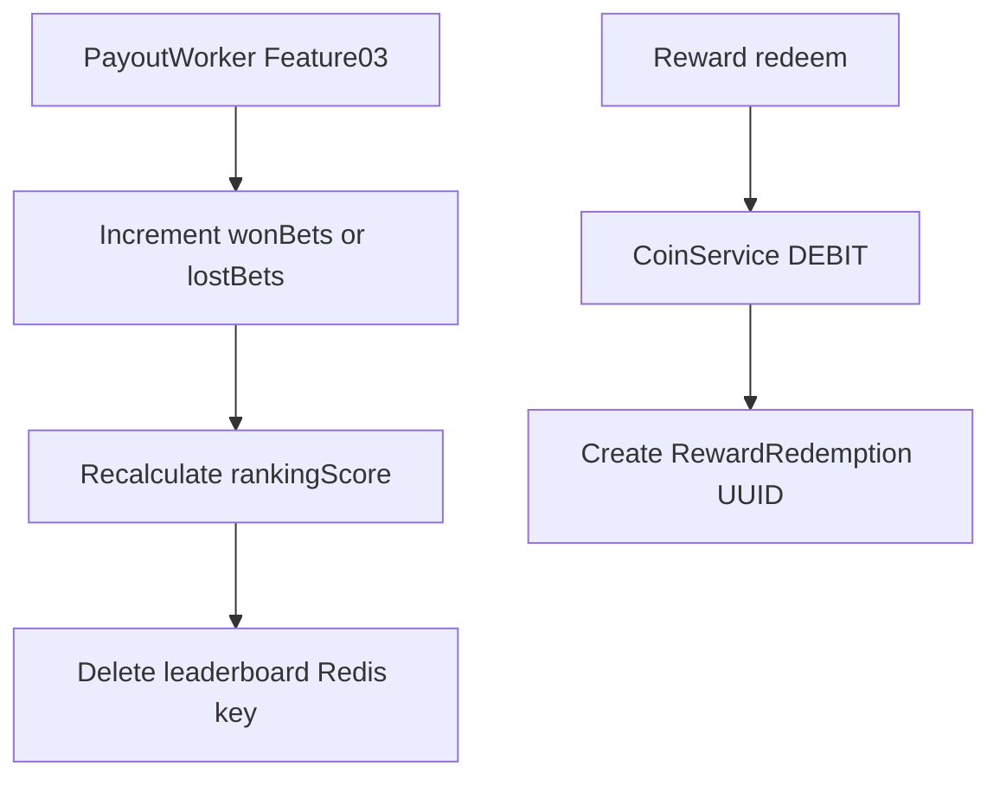

# Feature 04 — Gamification (Ranking) and Reward Redemption

**Status:** Planned

## Prompt summary

Build gamification: maintain per-user statistics (total bets, wins, losses, win rate) and compute a ranking score (e.g. `wins * 10 + balance * 0.1`). Update stats after each bet resolution. Expose a top-100 leaderboard endpoint with Redis cache. Create a rewards system: admin registers rewards with coin cost, stock, and image; users redeem (deduct coins) and receive a unique ticket (UUID code); admin can validate tickets later.

## Current state in SarradaBet

| Item | Status |
|------|--------|
| `UserAction` model | Schema + seed only — audit log, not stats |
| Ranking / leaderboard | Not implemented |
| `UserStats` table | Does not exist |
| Rewards / tickets | Does not exist |
| Redis | Not in stack (`node-cache` in-memory only) |

Related stub: [`UserAction`](../../apps/api/prisma/schema.prisma) tracks admin actions (`CREATE_BET`, `RESOLVE_BET`) — do not confuse with player stats.

## Recommended technical references

| Topic | Reference |
|-------|-----------|
| Redis cache | [`ioredis`](https://www.npmjs.com/package/ioredis) — new dependency for leaderboard TTL |
| Stats updates | Transaction after payout in Feature 03 |
| Ticket codes | [`uuid`](https://www.npmjs.com/package/uuid) v4 |
| Ranking formula | Document as config constant, e.g. `RANKING_WIN_WEIGHT=10`, `RANKING_BALANCE_WEIGHT=0.1` |
| Optional tiers | Bronze / Silver / Gold bands based on score thresholds |

## Proposed schema / API changes

### Prisma schema

```prisma
model UserStats {
  userId       Int   @id @map("user_id")
  totalBets    Int   @default(0) @map("total_bets")
  wonBets      Int   @default(0) @map("won_bets")
  lostBets     Int   @default(0) @map("lost_bets")
  winRate      Float @default(0) @map("win_rate")  // computed: wonBets / totalBets
  rankingScore Float @default(0) @map("ranking_score")
  updatedAt    DateTime @updatedAt @map("updated_at")

  user User @relation(fields: [userId], references: [id], onDelete: Cascade)
  @@map("user_stats")
}

model Reward {
  id          Int      @id @default(autoincrement())
  title       String
  description String?
  coinCost    Int      @map("coin_cost")
  stock       Int      @default(0)
  imageUrl    String?  @map("image_url")
  isActive    Boolean  @default(true) @map("is_active")
  redemptions RewardRedemption[]
  createdAt   DateTime @default(now()) @map("created_at")
  updatedAt   DateTime @updatedAt @map("updated_at")

  @@map("rewards")
}

model RewardRedemption {
  id         Int      @id @default(autoincrement())
  rewardId   Int      @map("reward_id")
  userId     Int      @map("user_id")
  ticketCode String   @unique @map("ticket_code") @db.VarChar(36)
  redeemedAt DateTime @default(now()) @map("redeemed_at")
  validatedAt DateTime? @map("validated_at")
  validatedBy Int?     @map("validated_by")

  reward Reward @relation(fields: [rewardId], references: [id])
  user   User   @relation(fields: [userId], references: [id])

  @@map("reward_redemptions")
}
```

### Ranking formula

```
rankingScore = (wonBets * WIN_WEIGHT) + (coinBalance * BALANCE_WEIGHT)
// Default: WIN_WEIGHT = 10, BALANCE_WEIGHT = 0.1
winRate = totalBets > 0 ? wonBets / totalBets : 0
```

Recalculate `rankingScore` on stats update (balance comes from `User.coinBalance` at query time or denormalized).

### API routes

| Method | Route | Access |
|--------|-------|--------|
| GET | `/api/v1/leaderboard?limit=100` | Public (cached) |
| GET | `/api/v1/users/me/stats` | Authenticated |
| CRUD | `/api/v1/admin/rewards` | Admin |
| GET | `/api/v1/rewards` | Public — active rewards |
| POST | `/api/v1/rewards/:id/redeem` | Authenticated |
| POST | `/api/v1/admin/rewards/tickets/:code/validate` | Admin |

### Cache strategy

```
Key: leaderboard:top100
TTL: 300 seconds (5 min)
Invalidate: on any stats update (or accept stale cache for simplicity)
```

## Stats update flow (proposed)



## Implementation checklist

### Backend

- [ ] Add Prisma models + migration
- [ ] `UserStatsService` — upsert stats, recalculate score
- [ ] Hook stats update from payout worker (Feature 03)
- [ ] `LeaderboardService` — query top 100, Redis cache via `ioredis`
- [ ] `RewardService` — admin CRUD, user redeem with stock check + coin debit
- [ ] Admin ticket validation endpoint
- [ ] Zod schemas for all new endpoints

### Shared types

- [ ] `packages/types/src/stats.ts` — `UserStats`, `LeaderboardEntry`
- [ ] `packages/types/src/reward.ts` — `Reward`, `RewardRedemption`

### Frontend

- [ ] Leaderboard page or section on home
- [ ] Rewards catalog + redeem flow
- [ ] Admin rewards CRUD page
- [ ] Admin ticket validation UI

## Key files

| Path | Action |
|------|--------|
| [`apps/api/prisma/schema.prisma`](../../apps/api/prisma/schema.prisma) | **extend** |
| `apps/api/src/modules/stats/` | **create** |
| `apps/api/src/modules/reward/` | **create** |
| `apps/api/src/modules/coin/services/CoinService.ts` | **extend** — new debit source `REWARD_REDEMPTION` (optional enum) |
| `apps/api/src/jobs/payout.worker.ts` | **extend** — call stats update |
| `packages/types/src/` | **extend** |
| `apps/web/src/pages/` | **create** — LeaderboardPage, RewardsPage, AdminRewardsPage |

## Acceptance criteria

- [ ] After bet resolution, winner/loser stats increment correctly
- [ ] Leaderboard returns top 100 ordered by `rankingScore`
- [ ] Leaderboard response served from cache within TTL
- [ ] User cannot redeem reward with insufficient coins or zero stock
- [ ] Redemption creates unique UUID ticket; coins debited atomically
- [ ] Admin can validate ticket once; second validation rejected

## Dependencies

- [Feature 01 — User auth](./01-user-auth-and-crud.md)
- [Feature 02 — Coins](./02-coins-and-pix-payments.md) — debit on redeem
- [Feature 03 — Bet payout](./03-bet-closure-and-payout.md) — stats source events

## Test plan

| Test | Coverage |
|------|----------|
| `userStats.service.test.ts` | Increment, win rate, score formula |
| `leaderboard.service.test.ts` | Ordering, cache hit/miss |
| `reward.service.test.ts` | Redeem, stock, duplicate ticket validation |
| Integration | Redeem → balance ↓, ticket created |

Run: `npm run test --workspace=apps/api`
