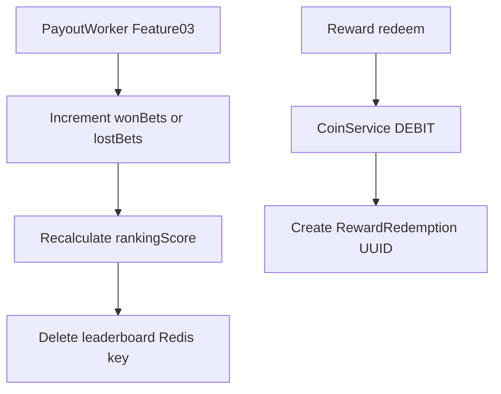

# Feature 04 — Gamification (Ranking) and Reward Redemption

**Status:** Done (API + web + E2E; redemption history cards wired on profile)

## Prompt summary

Build gamification: maintain per-user statistics (total bets, wins, losses, win rate) and compute a ranking score (e.g. `wins * 10 + balance * 0.1`). Update stats after each bet resolution. Expose a top-100 leaderboard endpoint with Redis cache. Create a rewards system: admin registers rewards with coin cost, stock, and image; users redeem (deduct coins) and receive a unique ticket (UUID code); admin can validate tickets later.

## Current state in SarradaBet

| Item | Status |
|------|--------|
| `UserStats` model + service | Done — [`UserStatsService.ts`](../../apps/api/src/modules/stats/services/UserStatsService.ts) |
| Ranking / leaderboard | Done — [`LeaderboardService.ts`](../../apps/api/src/modules/stats/services/LeaderboardService.ts), Redis cache |
| Rewards + ticket redemption | Done — [`RewardService.ts`](../../apps/api/src/modules/reward/services/RewardService.ts) |
| Ticket PNG + verify | Done — [`TicketImageService.ts`](../../apps/api/src/modules/ticket/services/TicketImageService.ts) |
| Web pages | [`LeaderboardPage`](../../apps/web/src/pages/LeaderboardPage.tsx), [`RewardsPage`](../../apps/web/src/pages/RewardsPage.tsx), [`AdminRewardsPage`](../../apps/web/src/pages/AdminRewardsPage.tsx) |
| Redemption history UI | [`PendingRedemptionsCard`](../../apps/web/src/components/gamification/PendingRedemptionsCard.tsx), [`RegisteredRedemptionsCard`](../../apps/web/src/components/gamification/RegisteredRedemptionsCard.tsx) on profile |
| Shared types | [`stats.ts`](../../packages/types/src/stats.ts), [`reward.ts`](../../packages/types/src/reward.ts), [`ticket.ts`](../../packages/types/src/ticket.ts) |
| `UserAction` model | Audit log only — not player stats |

Related: [`UserAction`](../../apps/api/prisma/schema.prisma) tracks admin actions (`CREATE_BET`, `RESOLVE_BET`) — do not confuse with player stats.

## Recommended technical references

| Topic | Reference |
|-------|-----------|
| Redis cache | [`ioredis`](https://www.npmjs.com/package/ioredis) — new dependency for leaderboard TTL |
| Stats updates | Transaction after payout in Feature 03 |
| Ticket codes | [`uuid`](https://www.npmjs.com/package/uuid) v4 |
| Ranking formula | Document as config constant, e.g. `RANKING_WIN_WEIGHT=10`, `RANKING_BALANCE_WEIGHT=0.1` |
| Optional tiers | Bronze / Silver / Gold bands based on score thresholds |

## Proposed schema / API changes

### Prisma schema

```prisma
model UserStats {
  userId       Int   @id @map("user_id")
  totalBets    Int   @default(0) @map("total_bets")
  wonBets      Int   @default(0) @map("won_bets")
  lostBets     Int   @default(0) @map("lost_bets")
  winRate      Float @default(0) @map("win_rate")  // computed: wonBets / totalBets
  rankingScore Float @default(0) @map("ranking_score")
  updatedAt    DateTime @updatedAt @map("updated_at")

  user User @relation(fields: [userId], references: [id], onDelete: Cascade)
  @@map("user_stats")
}

model Reward {
  id          Int      @id @default(autoincrement())
  title       String
  description String?
  coinCost    Int      @map("coin_cost")
  stock       Int      @default(0)
  imageUrl    String?  @map("image_url")
  isActive    Boolean  @default(true) @map("is_active")
  redemptions RewardRedemption[]
  createdAt   DateTime @default(now()) @map("created_at")
  updatedAt   DateTime @updatedAt @map("updated_at")

  @@map("rewards")
}

model RewardRedemption {
  id         Int      @id @default(autoincrement())
  rewardId   Int      @map("reward_id")
  userId     Int      @map("user_id")
  ticketCode String   @unique @map("ticket_code") @db.VarChar(36)
  redeemedAt DateTime @default(now()) @map("redeemed_at")
  validatedAt DateTime? @map("validated_at")
  validatedBy Int?     @map("validated_by")

  reward Reward @relation(fields: [rewardId], references: [id])
  user   User   @relation(fields: [userId], references: [id])

  @@map("reward_redemptions")
}
```

### Ranking formula

```
rankingScore = (wonBets * WIN_WEIGHT) + (coinBalance * BALANCE_WEIGHT)
// Default: WIN_WEIGHT = 10, BALANCE_WEIGHT = 0.1
winRate = totalBets > 0 ? wonBets / totalBets : 0
```

Recalculate `rankingScore` on stats update (balance comes from `User.coinBalance` at query time or denormalized).

### API routes

| Method | Route | Access |
|--------|-------|--------|
| GET | `/api/v1/leaderboard?limit=100` | Public (cached) |
| GET | `/api/v1/users/me/stats` | Authenticated |
| CRUD | `/api/v1/admin/rewards` | Admin |
| GET | `/api/v1/rewards` | Public — active rewards |
| POST | `/api/v1/rewards/:id/redeem` | Authenticated |
| POST | `/api/v1/admin/rewards/tickets/:code/validate` | Admin |

### Cache strategy

```
Key: leaderboard:top100
TTL: 300 seconds (5 min)
Invalidate: on any stats update (or accept stale cache for simplicity)
```

## Stats update flow (proposed)


```mermaid
flowchart TD
  payout[PayoutWorker Feature03] --> updateStats[Increment wonBets or lostBets]
  updateStats --> recalcScore[Recalculate rankingScore]
  recalcScore --> invalidateCache[Delete leaderboard Redis key]
  redeem[Reward redeem] --> debitCoins[CoinService DEBIT]
  debitCoins --> createTicket[Create RewardRedemption UUID]
```

## Gherkin Specifications (BDD)

Os seguintes cenários Gherkin definem o comportamento esperado para o sistema de gamificação, ranking, catálogo de recompensas e resgate com validação de tickets. Eles devem ser implementados como testes E2E executáveis usando Playwright + Cucumber.

```gherkin
Funcionalidade: Gamificação, Ranking e Resgate de Recompensas
  Como um usuário e um administrador
  Eu quero ver minhas estatísticas, competir no ranking e resgatar recompensas com tickets
  Para que eu seja engajado pela gamificação e possa trocar minhas moedas por prêmios

  Contexto:
    Dado que um usuário "Jogador" está autenticado com saldo de "500" moedas
    E um usuário administrador "Admin" está autenticado

  # --- ATUALIZAÇÃO DE ESTATÍSTICAS ---

  @smoke @stats
  Cenário: Estatísticas do usuário são atualizadas após uma vitória
    Dado que o payout worker processou um voto vencedor para o "Jogador"
    Quando o sistema atualiza as estatísticas do usuário
    Então o campo "totalBets" do "Jogador" incrementa em "1"
    E o campo "wonBets" do "Jogador" incrementa em "1"
    E o campo "lostBets" do "Jogador" permanece inalterado
    E a "winRate" é recalculada para "wonBets / totalBets"
    E o "rankingScore" é recalculado usando a fórmula: (wonBets * 10) + (coinBalance * 0.1)

  @smoke @stats
  Cenário: Estatísticas do usuário são atualizadas após uma derrota
    Dado que o payout worker processou um voto perdedor para o "Jogador"
    Quando o sistema atualiza as estatísticas do usuário
    Então o campo "totalBets" do "Jogador" incrementa em "1"
    E o campo "lostBets" do "Jogador" incrementa em "1"
    E o campo "wonBets" do "Jogador" permanece inalterado
    E a "winRate" é recalculada para "wonBets / totalBets"

  @stats @edge
  Cenário: WinRate é zero quando o usuário não tem apostas
    Dado que um usuário "Novato" não possui nenhuma aposta registrada
    Quando o sistema calcula a winRate para "Novato"
    Então o valor retornado é "0.0"

  # --- LEADERBOARD / RANKING ---

  @smoke @leaderboard
  Cenário: Leaderboard retorna os top 100 usuários ordenados por rankingScore
    Dado que existem "150" usuários com diferentes valores de rankingScore
    Quando uma requisição GET é feita para "/api/v1/leaderboard?limit=100"
    Então a resposta contém exatamente "100" entradas
    E as entradas estão ordenadas de forma decrescente por "rankingScore"
    E cada entrada contém: "userId", "username", "rankingScore", "winRate"

  @smoke @leaderboard @cache
  Cenário: Leaderboard é servido a partir do cache Redis dentro do TTL
    Dado que o leaderboard já foi consultado uma vez e cacheado
    Quando uma segunda requisição GET é feita para "/api/v1/leaderboard" dentro de "5 minutos"
    Então a resposta é servida do cache
    E nenhuma consulta ao banco de dados é executada para a listagem

  @leaderboard @cache
  Cenário: Cache do leaderboard é invalidado após atualização de estatísticas
    Dado que o leaderboard está cacheado em Redis com a chave "leaderboard:top100"
    Quando o sistema atualiza as estatísticas de um usuário
    Então a chave "leaderboard:top100" é deletada do Redis
    E a próxima requisição ao leaderboard faz uma nova consulta ao banco de dados

  @leaderboard
  Cenário: Usuário pode visualizar suas próprias estatísticas
    Quando o usuário "Jogador" faz uma requisição GET para "/api/v1/users/me/stats"
    Então a resposta contém:
      | campo        | valor         |
      | totalBets    | (valor atual) |
      | wonBets      | (valor atual) |
      | lostBets     | (valor atual) |
      | winRate      | (valor atual) |
      | rankingScore | (valor atual) |

  # --- CATÁLOGO DE RECOMPENSAS ---

  @smoke @rewards
  Cenário: Usuário visualiza catálogo de recompensas ativas
    Dado que existem recompensas cadastradas com status "isActive = true"
    Quando o usuário faz uma requisição GET para "/api/v1/rewards"
    Então a resposta contém apenas as recompensas com "isActive = true"
    E cada recompensa exibe: "id", "title", "description", "coinCost", "stock", "imageUrl"
    E recompensas com "stock = 0" ou "isActive = false" são ocultadas

  @smoke @admin
  Cenário: Administrador cria uma nova recompensa
    Dado que o "Admin" está autenticado
    Quando o administrador envia uma requisição POST para "/api/v1/admin/rewards" com:
      | campo        | valor              |
      | title        | Camisa Oficial     |
      | description  | Camisa autografada |
      | coinCost     | 1000               |
      | stock        | 10                 |
      | imageUrl     | https://...        |
    Então a recompensa é criada com os dados fornecidos
    E o campo "isActive" é definido como "true" por padrão

  @admin @validation
  Cenário: Administrador não pode criar recompensa com stock negativo
    Dado que o "Admin" está autenticado
    Quando o administrador tenta criar uma recompensa com "stock = -1"
    Então o sistema rejeita a requisição com erro "Stock não pode ser negativo"

  # --- RESGATE DE RECOMPENSAS ---

  @smoke @redeem
  Cenário: Usuário resgata uma recompensa com sucesso
    Dado que existe uma recompensa ativa "Camisa Oficial" com custo "1000" e estoque "5"
      E o usuário "Jogador" tem saldo de "1500" moedas
    Quando o usuário faz uma requisição POST para "/api/v1/rewards/1/redeem"
    Então o sistema debita "1000" moedas do saldo do "Jogador" (saldo final "500")
    E uma transação "REWARD_REDEMPTION" é registrada com valor "-1000"
    E o estoque da recompensa diminui de "5" para "4"
    E uma nova "RewardRedemption" é criada com "ticketCode" único (UUID v4)
    E a resposta contém o "ticketCode" gerado

  @smoke @redeem @validation
  Cenário: Usuário não consegue resgatar recompensa com saldo insuficiente
    Dado que existe uma recompensa ativa com custo "1000"
      E o usuário "Jogador" tem saldo de "500" moedas
    Quando o usuário tenta resgatar a recompensa
    Então o sistema rejeita a requisição com erro "Saldo insuficiente"
    E o saldo do usuário permanece "500"
    E o estoque da recompensa não é alterado
    E nenhum ticket é gerado

  @redeem @validation
  Cenário: Usuário não consegue resgatar recompensa com estoque zerado
    Dado que existe uma recompensa ativa com estoque "0"
    Quando o usuário tenta resgatar a recompensa
    Então o sistema rejeita a requisição com erro "Recompensa sem estoque disponível"
    E nenhum ticket é gerado

  @redeem @validation
  Cenário: Usuário não consegue resgatar recompensa inativa
    Dado que existe uma recompensa com "isActive = false"
    Quando o usuário tenta resgatar a recompensa
    Então o sistema rejeita a requisição com erro "Recompensa não está disponível"

  @redeem @atomic
  Cenário: Resgate é atômico e não gera ticket em caso de falha no débito
    Dado que o serviço de débito de moedas falha (simulando erro)
    Quando o usuário tenta resgatar uma recompensa
    Então nenhuma "RewardRedemption" é criada
    E o estoque da recompensa não é alterado
    E o sistema retorna um erro genérico "Falha no resgate, tente novamente"

  # --- VALIDAÇÃO DE TICKETS (ADMIN) ---

  @smoke @admin
  Cenário: Administrador valida um ticket válido com sucesso
    Dado que o usuário "Jogador" resgatou uma recompensa e recebeu o ticket "abc-123-def"
      E o ticket ainda não foi validado
    Quando o administrador faz uma requisição POST para "/api/v1/admin/rewards/tickets/abc-123-def/validate"
    Então o campo "validatedAt" da "RewardRedemption" é preenchido com a data atual
    E o campo "validatedBy" recebe o "userId" do administrador
    E a resposta contém: "valid": true, "message": "Ticket validado com sucesso"

  @smoke @admin @validation
  Cenário: Administrador não consegue validar um ticket já utilizado
    Dado que o ticket "abc-123-def" já possui "validatedAt" preenchido
    Quando o administrador tenta validar o mesmo ticket novamente
    Então o sistema rejeita a requisição com erro "Ticket já foi validado anteriormente"
    E o campo "validatedAt" não é alterado

  @admin @validation
  Cenário: Administrador não consegue validar um ticket inexistente
    Dado que não existe nenhum ticket com o código "codigo-invalido"
    Quando o administrador tenta validar "codigo-invalido"
    Então o sistema rejeita a requisição com erro "Ticket não encontrado"

  @admin @validation
  Cenário: Apenas administradores podem validar tickets
    Dado que um usuário comum "Jogador" está autenticado
    Quando o "Jogador" tenta validar um ticket
    Então o sistema retorna erro HTTP 403 (Forbidden)
    E a validação não é executada

  # --- CASOS DE BORDA ---

  @edge
  Cenário: RankingScore é recalculado corretamente quando o saldo do usuário muda
    Dado que o "Jogador" tem "wonBets = 5" e "coinBalance = 200"
      E o rankingScore atual é "(5 * 10) + (200 * 0.1) = 70"
    Quando o "Jogador" resgata uma recompensa e gasta "100" moedas (saldo "100")
      E o sistema recalcula o rankingScore (atualização deve ser acionada pelo resgate)
    Então o novo rankingScore é "(5 * 10) + (100 * 0.1) = 51"
    E o rankingScore é atualizado na tabela "UserStats"

  @edge
  Cenário: Sistema lida com grande volume de resgates simultâneos no mesmo estoque
    Dado que uma recompensa tem estoque "1"
      E "2" usuários tentam resgatar a mesma recompensa simultaneamente
    Quando ambos os resgates são processados
    Então apenas "1" resgate é bem-sucedido
    E o outro recebe erro "Estoque esgotado"
    E nenhum ticket duplicado é gerado
```

## Implementation checklist

### Backend

- [x] Add Prisma models + migration
- [x] `UserStatsService` — upsert stats, recalculate score
- [x] Hook stats update from payout worker (Feature 03)
- [x] `LeaderboardService` — query top 100, Redis cache via `ioredis`
- [x] `RewardService` — admin CRUD, user redeem with stock check + coin debit
- [x] Admin ticket validation endpoint
- [x] Zod schemas for all new endpoints

### Shared types

- [x] `packages/types/src/stats.ts` — `UserStats`, `LeaderboardEntry`
- [x] `packages/types/src/reward.ts` — `Reward`, `RewardRedemption`

### Frontend

- [x] Leaderboard page or section on home
- [x] Rewards catalog + redeem flow
- [x] Admin rewards CRUD page
- [x] Admin ticket validation UI
- [x] Visual ticket PNG generation (480×800 portrait, QR, PT-BR watermarks, Redis cache 1h)
- [x] Public ticket verification page `/tickets/verify/:code`
- [x] Redemption history cards on profile page

## Ticket images

On redeem, users receive `ticketImageUrl` and can download a PNG with QR code encoding `{PUBLIC_WEB_URL}/tickets/verify/{uuid}`. Redemption watermark: **APENAS RETIRADA**. After admin validation, admins download a separate PNG with **VALIDADO PELA ADMINISTRAÇÃO** watermark and VALIDADO stamp.

| Endpoint | Access |
|----------|--------|
| `GET /api/v1/rewards/tickets/:code/image` | Ticket owner |
| `GET /api/v1/rewards/tickets/:code/validate-image` | Ticket owner (validated only) |
| `GET /api/v1/admin/rewards/tickets/:code/validate-image` | Admin (validated tickets only) |
| `GET /api/v1/tickets/verify/:code` | Public JSON verify |

Images are generated on-the-fly with `sharp` + `qrcode`, cached in Redis (`TICKET_IMAGE_CACHE_TTL`, default 3600s). Rate limit: 5 downloads/minute per user (`TICKET_IMAGE_RATE_LIMIT_MAX`).

E2E scenarios: [`e2e/features/ticket-images.feature`](../../e2e/features/ticket-images.feature).

## Key files

| Path | Action |
|------|--------|
| [`apps/api/prisma/schema.prisma`](../../apps/api/prisma/schema.prisma) | **extend** |
| `apps/api/src/modules/stats/` | **create** |
| `apps/api/src/modules/reward/` | **create** |
| `apps/api/src/modules/ticket/` | **create** — PNG generation, verify, cache |
| `apps/api/src/modules/coin/services/CoinService.ts` | **extend** — new debit source `REWARD_REDEMPTION` (optional enum) |
| `apps/api/src/jobs/payout.worker.ts` | **extend** — call stats update |
| `packages/types/src/` | **extend** |
| `apps/web/src/pages/` | **create** — LeaderboardPage, RewardsPage, AdminRewardsPage |

## Acceptance criteria

- [x] After bet resolution, winner/loser stats increment correctly
- [x] Leaderboard returns top 100 ordered by `rankingScore`
- [x] Leaderboard response served from cache within TTL
- [x] User cannot redeem reward with insufficient coins or zero stock
- [x] Redemption creates unique UUID ticket; coins debited atomically
- [x] Admin can validate ticket once; second validation rejected

## Dependencies

- [Feature 01 — User auth](./01-user-auth-and-crud.md)
- [Feature 02 — Coins](./02-coins-and-pix-payments.md) — debit on redeem
- [Feature 03 — Bet payout](./03-bet-closure-and-payout.md) — stats source events

## Test plan

| Test | Coverage |
|------|----------|
| `userStats.service.test.ts` | Increment, win rate, score formula |
| `leaderboard.service.test.ts` | Ordering, cache hit/miss |
| `reward.service.test.ts` | Redeem, stock, duplicate ticket validation |
| Integration | Redeem → balance ↓, ticket created |

Run: `npm run test --workspace=apps/api`
