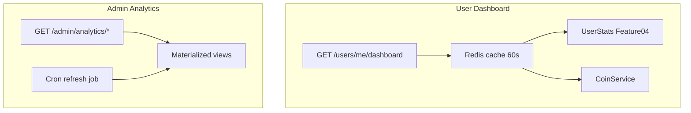

# Feature 05 — User Dashboard and Admin Analytics

**Status:** Planned

## Prompt summary

Build a logged-in user dashboard endpoint returning coin balance, bet totals, wins/losses, win rate, recent history (paginated), and ranking position. Use cache and keep stats in sync. For admins, implement analytics endpoints: active users, bet volume in coins, Pix revenue, bets by category, peak hours. Use PostgreSQL materialized views refreshed by a periodic job. Support date/category filters and CSV export.

## Current state in SarradaBet

### User dashboard

| Item | Status |
|------|--------|
| `/users/me/stats` or `/dashboard` | Does not exist |
| Coin balance endpoint | `GET /coins/balance` — exists |
| Transaction history | `GET /coins/transactions` — paginated, exists |
| User bet history | Not linked (votes anonymous) |
| Ranking position | Requires Feature 04 |

### Admin analytics

| Item | Status |
|------|--------|
| Admin dashboard page | [`AdminDashboard.tsx`](../../apps/web/src/pages/AdminDashboard.tsx) |
| Stat cards | [`AdminStatCards.tsx`](../../apps/web/src/components/admin/AdminStatCards.tsx) |
| Charts | [`BetsStatusChart.tsx`](../../apps/web/src/components/admin/BetsStatusChart.tsx), [`BetOddVotesChart.tsx`](../../apps/web/src/components/admin/BetOddVotesChart.tsx) |
| Pix revenue metrics | Not implemented |
| Materialized views | Not implemented |
| CSV export | Not implemented |
| Date/category filters | Not implemented |

Charts use **Recharts** — already a project dependency.

## Recommended technical references

| Topic | Reference |
|-------|-----------|
| Prisma aggregations | `groupBy`, `count`, `sum`, `_avg` |
| Materialized views | `CREATE MATERIALIZED VIEW daily_stats AS ...`; `REFRESH MATERIALIZED VIEW CONCURRENTLY daily_stats` |
| Cache | Redis (`ioredis`) for user dashboard — TTL ~60s, invalidate on coin/bet events |
| CSV export | [`fast-csv`](https://www.npmjs.com/package/fast-csv) or [`csv-writer`](https://www.npmjs.com/package/csv-writer) |
| Filters | Query params: `startDate`, `endDate`, `categoryId` |

## Proposed schema / API changes

### Materialized views (SQL migration)

```sql
CREATE MATERIALIZED VIEW daily_bet_stats AS
SELECT
  date_trunc('day', b.created_at) AS day,
  b.category_id,
  COUNT(*) AS bet_count,
  SUM(COALESCE(v.stake_total, 0)) AS coin_volume
FROM bets b
LEFT JOIN (
  SELECT bet_id, SUM(amount) AS stake_total
  FROM votes v JOIN odd o ON v.odd_id = o.id
  GROUP BY o.bet_id
) v ON v.bet_id = b.id
GROUP BY 1, 2;

CREATE UNIQUE INDEX ON daily_bet_stats (day, category_id);

-- Separate view for Pix revenue
CREATE MATERIALIZED VIEW daily_pix_revenue AS
SELECT
  date_trunc('day', paid_at) AS day,
  SUM(amount_cents) AS revenue_cents,
  COUNT(*) AS payment_count
FROM pix_payments
WHERE status = 'APPROVED' AND paid_at IS NOT NULL
GROUP BY 1;
```

Refresh job (cron/Bull): run nightly or hourly.

### API routes

#### User

| Method | Route | Response |
|--------|-------|----------|
| GET | `/api/v1/users/me/dashboard` | Balance, stats, rank, recent bets, recent transactions |

Example response shape:

```json
{
  "balance": 150,
  "stats": { "totalBets": 42, "wonBets": 18, "lostBets": 24, "winRate": 0.43 },
  "ranking": { "score": 195, "position": 12 },
  "recentBets": { "data": [], "pagination": {} },
  "recentTransactions": { "data": [], "pagination": {} }
}
```

#### Admin

| Method | Route | Description |
|--------|-------|-------------|
| GET | `/api/v1/admin/analytics/overview` | KPIs for date range |
| GET | `/api/v1/admin/analytics/bets-by-category` | Grouped counts/volume |
| GET | `/api/v1/admin/analytics/pix-revenue` | Revenue time series |
| GET | `/api/v1/admin/analytics/peak-hours` | Hour-of-day histogram |
| GET | `/api/v1/admin/analytics/export` | CSV download |

Query params (all admin analytics): `startDate`, `endDate`, `categoryId?`

## Architecture (proposed)



## Implementation checklist

### Backend — user dashboard

- [ ] `DashboardService.getUserDashboard(userId)` — aggregate from Feature 04 stats + coin modules
- [ ] Paginate recent bets (requires user-linked votes — Feature 03)
- [ ] Paginate recent transactions (reuse `CoinRepository.listTransactions`)
- [ ] Redis cache with invalidation on coin/bet events
- [ ] Route + controller + Zod query schemas

### Backend — admin analytics

- [ ] Raw SQL or Prisma `$queryRaw` against materialized views
- [ ] Overview endpoint: active users (logged in / placed bet in range), total volume, Pix revenue
- [ ] Peak hours: `EXTRACT(hour FROM created_at)` aggregation
- [ ] CSV export stream for selected report
- [ ] Refresh materialized views job

### Frontend — user

- [ ] `/dashboard` route (authenticated)
- [ ] Cards: balance, W/L, win rate, rank
- [ ] Tables: recent bets, transactions

### Frontend — admin

- [ ] Extend [`AdminDashboard.tsx`](../../apps/web/src/pages/AdminDashboard.tsx) with date range picker
- [ ] Pix revenue chart, category breakdown, peak hours chart
- [ ] Export CSV button

### Documentation

- [ ] Add admin analytics + user dashboard to [`docs/API.md`](../API.md)

## Key files

| Path | Action |
|------|--------|
| `apps/api/src/modules/dashboard/` | **create** |
| `apps/api/src/modules/analytics/` | **create** |
| `apps/api/prisma/migrations/` | **create** — materialized view SQL |
| `apps/api/src/jobs/refresh-analytics.job.ts` | **create** |
| [`AdminDashboard.tsx`](../../apps/web/src/pages/AdminDashboard.tsx) | **extend** |
| `apps/web/src/pages/UserDashboardPage.tsx` | **create** |
| [`packages/types/src/`](../../packages/types/src/) | **extend** — dashboard DTOs |

## Acceptance criteria

- [ ] Authenticated user receives dashboard JSON with correct balance and stats
- [ ] Dashboard cache reduces DB load; invalidates after coin change
- [ ] Admin overview respects `startDate`/`endDate` filters
- [ ] Pix revenue matches sum of approved `PixPayment.amountCents` in range
- [ ] CSV export downloads valid file with headers
- [ ] Materialized view refresh job runs without blocking reads (`CONCURRENTLY`)

## Dependencies

- [Feature 03 — Bet payout](./03-bet-closure-and-payout.md) — meaningful user bet history
- [Feature 04 — Gamification](./04-gamification-and-rewards.md) — stats and ranking position

## Test plan

| Test | Coverage |
|------|----------|
| `dashboard.service.test.ts` | Aggregation, cache, pagination |
| `analytics.service.test.ts` | Date filters, category filter |
| Integration | Admin-only 403 for non-admin |
| SQL migration test | Materialized view refresh in CI (optional) |

Run: `npm run test --workspace=apps/api`
