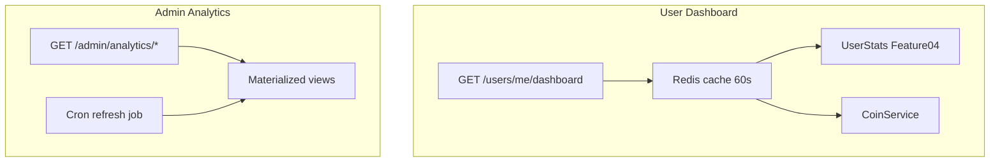

# Feature 05 — User Dashboard and Admin Analytics

**Status:** Implemented

## Prompt summary

Build a logged-in user dashboard endpoint returning coin balance, bet totals, wins/losses, win rate, recent history (paginated), and ranking position. Use cache and keep stats in sync. For admins, implement analytics endpoints: active users, bet volume in coins, Pix revenue, bets by category, peak hours. Use PostgreSQL materialized views refreshed by a periodic job. Support date/category filters and CSV export.

## Current state in SarradaBet

### User dashboard

| Item | Status |
|------|--------|
| `/users/me/stats` or `/dashboard` | Does not exist |
| Coin balance endpoint | `GET /coins/balance` — exists |
| Transaction history | `GET /coins/transactions` — paginated, exists |
| User bet history | Not linked (votes anonymous) |
| Ranking position | Requires Feature 04 |

### Admin analytics

| Item | Status |
|------|--------|
| Admin dashboard page | [`AdminDashboard.tsx`](../../apps/web/src/pages/AdminDashboard.tsx) |
| Stat cards | [`AdminStatCards.tsx`](../../apps/web/src/components/admin/AdminStatCards.tsx) |
| Charts | [`BetsStatusChart.tsx`](../../apps/web/src/components/admin/BetsStatusChart.tsx), [`BetOddVotesChart.tsx`](../../apps/web/src/components/admin/BetOddVotesChart.tsx) |
| Pix revenue metrics | Not implemented |
| Materialized views | Not implemented |
| CSV export | Not implemented |
| Date/category filters | Not implemented |

Charts use **Recharts** — already a project dependency.

## Recommended technical references

| Topic | Reference |
|-------|-----------|
| Prisma aggregations | `groupBy`, `count`, `sum`, `_avg` |
| Materialized views | `CREATE MATERIALIZED VIEW daily_stats AS ...`; `REFRESH MATERIALIZED VIEW CONCURRENTLY daily_stats` |
| Cache | Redis (`ioredis`) for user dashboard — TTL ~60s, invalidate on coin/bet events |
| CSV export | [`fast-csv`](https://www.npmjs.com/package/fast-csv) or [`csv-writer`](https://www.npmjs.com/package/csv-writer) |
| Filters | Query params: `startDate`, `endDate`, `categoryId` |

## Proposed schema / API changes

### Materialized views (SQL migration)

```sql
CREATE MATERIALIZED VIEW daily_bet_stats AS
SELECT
  date_trunc('day', b.created_at) AS day,
  b.category_id,
  COUNT(*) AS bet_count,
  SUM(COALESCE(v.stake_total, 0)) AS coin_volume
FROM bets b
LEFT JOIN (
  SELECT bet_id, SUM(amount) AS stake_total
  FROM votes v JOIN odd o ON v.odd_id = o.id
  GROUP BY o.bet_id
) v ON v.bet_id = b.id
GROUP BY 1, 2;

CREATE UNIQUE INDEX ON daily_bet_stats (day, category_id);

-- Separate view for Pix revenue
CREATE MATERIALIZED VIEW daily_pix_revenue AS
SELECT
  date_trunc('day', paid_at) AS day,
  SUM(amount_cents) AS revenue_cents,
  COUNT(*) AS payment_count
FROM pix_payments
WHERE status = 'APPROVED' AND paid_at IS NOT NULL
GROUP BY 1;
```

Refresh job (cron/Bull): run nightly or hourly.

### API routes

#### User

| Method | Route | Response |
|--------|-------|----------|
| GET | `/api/v1/users/me/dashboard` | Balance, stats, rank, recent bets, recent transactions |

Example response shape:

```json
{
  "balance": 150,
  "stats": { "totalBets": 42, "wonBets": 18, "lostBets": 24, "winRate": 0.43 },
  "ranking": { "score": 195, "position": 12 },
  "recentBets": { "data": [], "pagination": {} },
  "recentTransactions": { "data": [], "pagination": {} }
}
```

#### Admin

| Method | Route | Description |
|--------|-------|-------------|
| GET | `/api/v1/admin/analytics/overview` | KPIs for date range |
| GET | `/api/v1/admin/analytics/bets-by-category` | Grouped counts/volume |
| GET | `/api/v1/admin/analytics/pix-revenue` | Revenue time series |
| GET | `/api/v1/admin/analytics/peak-hours` | Hour-of-day histogram |
| GET | `/api/v1/admin/analytics/export` | CSV download |

Query params (all admin analytics): `startDate`, `endDate`, `categoryId?`

## Architecture (proposed)


```mermaid
flowchart TB
  subgraph userPath [User Dashboard]
    meDashboard[GET /users/me/dashboard]
    redisUser[Redis cache 60s]
    meDashboard --> redisUser
    redisUser --> userStats[UserStats Feature04]
    redisUser --> coinSvc[CoinService]
  end

  subgraph adminPath [Admin Analytics]
    adminAPI[GET /admin/analytics/*]
    matView[Materialized views]
    refreshJob[Cron refresh job]
    adminAPI --> matView
    refreshJob --> matView
  end
```

## Gherkin Specifications (BDD)

Os seguintes cenários Gherkin definem o comportamento esperado para o dashboard do usuário, painel de análises administrativas, filtros, cache e exportação de dados. Eles devem ser implementados como testes E2E executáveis usando Playwright + Cucumber.

```gherkin
Funcionalidade: Dashboard do Usuário e Análises Administrativas
  Como um usuário autenticado e um administrador
  Eu quero visualizar meu desempenho pessoal e métricas agregadas do sistema
  Para que eu possa acompanhar minha evolução e o administrador possa monitorar o negócio

  # ============================================
  # PARTE 1 — DASHBOARD DO USUÁRIO
  # ============================================

  Contexto: Dashboard do Usuário Autenticado
    Dado que um usuário "Jogador" está autenticado
    E o usuário possui estatísticas registradas via Feature 04
    E o usuário possui histórico de transações de moedas

  @smoke @dashboard
  Cenário: Usuário autenticado visualiza seu dashboard completo
    Quando o usuário faz uma requisição GET para "/api/v1/users/me/dashboard"
    Então a resposta contém os campos:
      | campo              | descrição                                    |
      | balance            | Saldo atual de moedas                        |
      | stats.totalBets    | Total de apostas realizadas                  |
      | stats.wonBets      | Total de apostas vencidas                    |
      | stats.lostBets     | Total de apostas perdidas                    |
      | stats.winRate      | Taxa de vitórias (wonBets / totalBets)       |
      | ranking.score      | Pontuação de ranking do usuário              |
      | ranking.position   | Posição do usuário no ranking global         |
      | recentBets.data    | Lista paginada das últimas apostas           |
      | recentTransactions.data | Lista paginada das últimas transações   |

  @smoke @dashboard @cache
  Cenário: Dashboard é servido a partir do cache Redis
    Dado que o dashboard do "Jogador" já foi consultado uma vez
    Quando uma segunda requisição GET é feita para "/api/v1/users/me/dashboard" dentro de "60 segundos"
    Então a resposta é servida do cache
    E nenhuma consulta adicional ao banco de dados é executada

  @dashboard @cache
  Cenário: Cache do dashboard é invalidado após alteração no saldo
    Dado que o dashboard do "Jogador" está cacheado em Redis
    Quando o usuário realiza uma transação que altera seu saldo (ex: resgate de recompensa)
    Então a chave de cache do dashboard do "Jogador" é deletada
    E a próxima requisição ao dashboard faz uma nova consulta ao banco de dados

  @dashboard @cache
  Cenário: Cache do dashboard é invalidado após nova aposta
    Dado que o dashboard do "Jogador" está cacheado em Redis
    Quando o usuário realiza uma nova aposta (voto) que altera suas estatísticas
    Então a chave de cache do dashboard do "Jogador" é deletada
    E a próxima requisição ao dashboard faz uma nova consulta ao banco de dados

  @dashboard @auth
  Cenário: Usuário não autenticado não pode acessar o dashboard
    Dado que nenhum usuário está autenticado
    Quando uma requisição GET é feita para "/api/v1/users/me/dashboard"
    Então o sistema retorna erro HTTP 401 (Unauthorized)

  @dashboard @pagination
  Cenário: Dashboard retorna histórico de apostas paginado corretamente
    Dado que o usuário "Jogador" possui "25" apostas registradas
    Quando o usuário faz uma requisição GET para "/api/v1/users/me/dashboard?page=2&limit=10"
    Então a resposta contém "10" itens na lista "recentBets.data"
    E o campo "recentBets.pagination" contém:
      | campo        | valor    |
      | page         | 2        |
      | limit        | 10       |
      | total        | 25       |
      | totalPages   | 3        |

  # ============================================
  # PARTE 2 — ANÁLISES ADMINISTRATIVAS
  # ============================================

  Contexto: Análises Administrativas
    Dado que um usuário administrador "Admin" está autenticado
    E que existem dados de apostas, pagamentos PIX e usuários no sistema

  @smoke @admin
  Cenário: Administrador visualiza visão geral de métricas com filtro de datas
    Quando o administrador faz uma requisição GET para "/api/v1/admin/analytics/overview"
      E os parâmetros "startDate=2026-01-01&endDate=2026-01-31" são fornecidos
    Então a resposta contém os campos:
      | campo              | descrição                                      |
      | activeUsers        | Número de usuários que realizaram apostas no período |
      | totalBets          | Total de apostas criadas no período            |
      | totalCoinVolume    | Volume total de moedas apostadas no período    |
      | pixRevenue         | Receita total de PIX aprovados no período (em reais) |
      | averageBetsPerUser | Média de apostas por usuário ativo             |

  @admin @filter
  Cenário: Filtro por categoria é aplicado corretamente nas métricas
    Dado que existem apostas nas categorias "Futebol" e "Basquete"
    Quando o administrador faz uma requisição GET para "/api/v1/admin/analytics/bets-by-category?categoryId=1"
    Então a resposta contém apenas dados da categoria "Futebol"
    E o campo "categoryName" é retornado com o nome correto

  @smoke @admin
  Cenário: Administrador visualiza receita PIX em série temporal
    Quando o administrador faz uma requisição GET para "/api/v1/admin/analytics/pix-revenue"
      E os parâmetros "startDate=2026-01-01&endDate=2026-01-31" são fornecidos
    Então a resposta contém um array de pontos com:
      | campo           | descrição                           |
      | day             | Data (YYYY-MM-DD)                   |
      | revenueCents    | Receita do dia em centavos          |
      | paymentCount    | Número de pagamentos aprovados no dia |

  @admin
  Cenário: Administrador visualiza distribuição de apostas por hora do dia
    Quando o administrador faz uma requisição GET para "/api/v1/admin/analytics/peak-hours"
      E os parâmetros "startDate=2026-01-01&endDate=2026-01-31" são fornecidos
    Então a resposta contém um array com "24" entradas (0 a 23 horas)
    E cada entrada contém:
      | campo    | descrição                           |
      | hour     | Hora do dia (0-23)                  |
      | betCount | Número de apostas criadas naquela hora |

  # ============================================
  # PARTE 3 — EXPORTAÇÃO CSV
  # ============================================

  @smoke @admin @csv
  Cenário: Administrador exporta dados analíticos para CSV
    Quando o administrador faz uma requisição GET para "/api/v1/admin/analytics/export"
      E os parâmetros "startDate=2026-01-01&endDate=2026-01-31&format=csv" são fornecidos
    Então a resposta tem Content-Type "text/csv"
    E o cabeçalho Content-Disposition contém "attachment; filename=analytics_*.csv"
    E o corpo da resposta é um CSV válido com as colunas esperadas

  @admin @csv
  Cenário: Exportação CSV inclui filtro por categoria
    Dado que o parâmetro "categoryId=2" é fornecido na exportação
    Quando o administrador exporta os dados para CSV
    Então o CSV contém apenas dados da categoria "categoryId=2"

  # ============================================
  # PARTE 4 — MATERIALIZED VIEWS E REFRESH
  # ============================================

  @job @analytics
  Cenário: Job agendado atualiza as materialized views
    Dado que novas apostas e pagamentos PIX foram registrados
    Quando o job de refresh de analytics é executado
    Então as materialized views "daily_bet_stats" e "daily_pix_revenue" são atualizadas
    E os dados mais recentes estão disponíveis nas consultas administrativas

  @job @analytics
  Cenário: Refresh das materialized views não bloqueia leituras (CONCURRENTLY)
    Dado que uma consulta administrativa está em execução contra uma materialized view
    Quando o job de refresh é executado com "CONCURRENTLY"
    Então a consulta em execução não é bloqueada
    E a view é atualizada sem interrupção do serviço

  # ============================================
  # PARTE 5 — SEGURANÇA E PERMISSÕES
  # ============================================

  @admin @auth
  Cenário: Usuário comum não pode acessar rotas administrativas
    Dado que um usuário comum "Jogador" está autenticado
    Quando o usuário faz uma requisição GET para "/api/v1/admin/analytics/overview"
    Então o sistema retorna erro HTTP 403 (Forbidden)

  @admin @auth
  Cenário: Rotas administrativas exigem autenticação
    Dado que nenhum usuário está autenticado
    Quando uma requisição GET é feita para "/api/v1/admin/analytics/overview"
    Então o sistema retorna erro HTTP 401 (Unauthorized)

  # ============================================
  # PARTE 6 — CASOS DE BORDA
  # ============================================

  @edge
  Cenário: Dashboard retorna dados vazios para usuário sem histórico
    Dado que um usuário "Novato" está autenticado e não possui apostas nem transações
    Quando o usuário acessa seu dashboard
    Então o campo "stats.totalBets" é "0"
    E o campo "stats.winRate" é "0.0"
    E o campo "ranking.position" é "null" ou indica que o usuário não está ranqueado
    E as listas "recentBets.data" e "recentTransactions.data" estão vazias

  @edge
  Cenário: Visão geral de analytics retorna zeros para período sem dados
    Dado que não existem apostas ou pagamentos no período "2025-01-01" a "2025-01-01"
    Quando o administrador consulta a visão geral para esse período
    Então todos os campos numéricos retornam "0"
    E a resposta não contém erros

  @edge
  Cenário: Filtro com data de início maior que data de fim é rejeitado
    Quando o administrador faz uma requisição GET com "startDate=2026-01-31&endDate=2026-01-01"
    Então o sistema rejeita a requisição com erro "Data de início deve ser anterior à data de fim"
    E retorna HTTP 400 (Bad Request)

  @edge
  Cenário: Exportação CSV lida com grandes volumes de dados via streaming
    Dado que existem "10000" registros no período solicitado
    Quando o administrador exporta os dados para CSV
    Então a resposta é gerada em streaming sem timeout
    E o arquivo CSV contém todos os "10000" registros

  @edge
  Cenário: Cache do dashboard não expõe dados de um usuário para outro
    Dado que o dashboard do "Jogador" está cacheado em Redis
    Quando o usuário "OutroJogador" faz uma requisição para seu próprio dashboard
    Então a resposta contém apenas os dados de "OutroJogador"
    E os dados do cache do "Jogador" não são retornados acidentalmente
```

## Implementation checklist

### Backend — user dashboard

- [ ] `DashboardService.getUserDashboard(userId)` — aggregate from Feature 04 stats + coin modules
- [ ] Paginate recent bets (requires user-linked votes — Feature 03)
- [ ] Paginate recent transactions (reuse `CoinRepository.listTransactions`)
- [ ] Redis cache with invalidation on coin/bet events
- [ ] Route + controller + Zod query schemas

### Backend — admin analytics

- [ ] Raw SQL or Prisma `$queryRaw` against materialized views
- [ ] Overview endpoint: active users (logged in / placed bet in range), total volume, Pix revenue
- [ ] Peak hours: `EXTRACT(hour FROM created_at)` aggregation
- [ ] CSV export stream for selected report
- [ ] Refresh materialized views job

### Frontend — user

- [ ] `/dashboard` route (authenticated)
- [ ] Cards: balance, W/L, win rate, rank
- [ ] Tables: recent bets, transactions

### Frontend — admin

- [ ] Extend [`AdminDashboard.tsx`](../../apps/web/src/pages/AdminDashboard.tsx) with date range picker
- [ ] Pix revenue chart, category breakdown, peak hours chart
- [ ] Export CSV button

### Documentation

- [ ] Add admin analytics + user dashboard to [`docs/API.md`](../API.md)

## Key files

| Path | Action |
|------|--------|
| `apps/api/src/modules/dashboard/` | **create** |
| `apps/api/src/modules/analytics/` | **create** |
| `apps/api/prisma/migrations/` | **create** — materialized view SQL |
| `apps/api/src/jobs/refresh-analytics.job.ts` | **create** |
| [`AdminDashboard.tsx`](../../apps/web/src/pages/AdminDashboard.tsx) | **extend** |
| `apps/web/src/pages/UserDashboardPage.tsx` | **create** |
| [`packages/types/src/`](../../packages/types/src/) | **extend** — dashboard DTOs |

## Acceptance criteria

- [ ] Authenticated user receives dashboard JSON with correct balance and stats
- [ ] Dashboard cache reduces DB load; invalidates after coin change
- [ ] Admin overview respects `startDate`/`endDate` filters
- [ ] Pix revenue matches sum of approved `PixPayment.amountCents` in range
- [ ] CSV export downloads valid file with headers
- [ ] Materialized view refresh job runs without blocking reads (`CONCURRENTLY`)

## Dependencies

- [Feature 03 — Bet payout](./03-bet-closure-and-payout.md) — meaningful user bet history
- [Feature 04 — Gamification](./04-gamification-and-rewards.md) — stats and ranking position

## Test plan

| Test | Coverage |
|------|----------|
| `dashboard.service.test.ts` | Aggregation, cache, pagination |
| `analytics.service.test.ts` | Date filters, category filter |
| Integration | Admin-only 403 for non-admin |
| SQL migration test | Materialized view refresh in CI (optional) |

Run: `npm run test --workspace=apps/api`