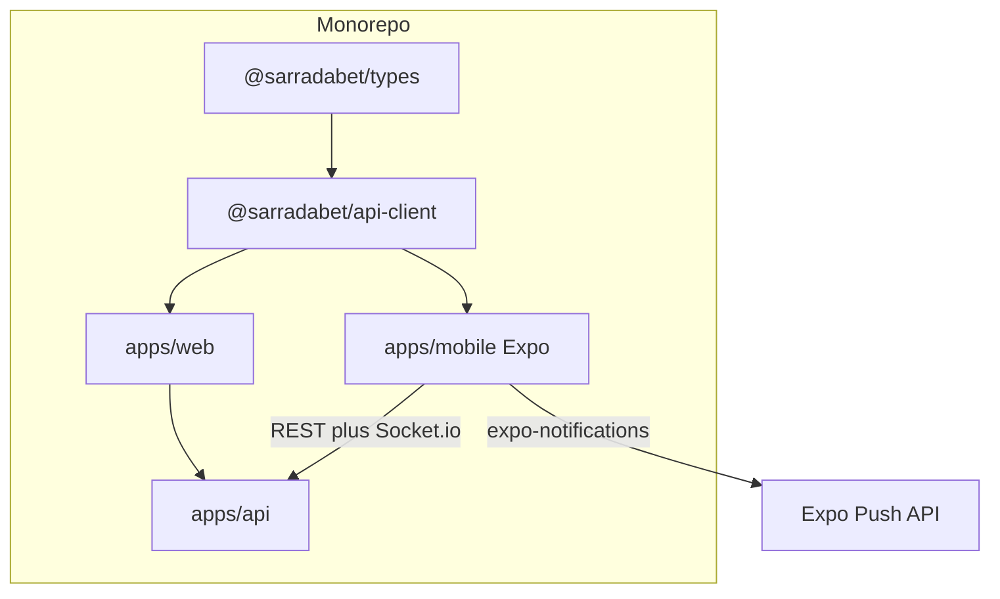

# Feature 06 — Mobile App (React Native) and Advanced Admin Panel

**Status:** Planned

## Prompt summary

Build a React Native + Expo mobile app in the monorepo, sharing types and API client packages. Implement auth with local token storage, automatic refresh, and Socket.io for live odds. Add push notifications for important events. In parallel, enhance the web admin panel: user management (ban, adjust coins), rewards CRUD, Pix payment monitoring, and analytics dashboards with charts. Restrict all admin routes to administrators.

## Current state in SarradaBet

### Mobile

| Item | Status |
|------|--------|
| `apps/mobile` | Does not exist |
| `@sarradabet/api-client` | Does not exist — only [`@sarradabet/types`](../../packages/types/) |
| Push notifications | Not implemented |

### Admin panel (web)

| Page | Path | Status |
|------|------|--------|
| Dashboard | [`AdminDashboard.tsx`](../../apps/web/src/pages/AdminDashboard.tsx) | Basic stats/charts |
| Bets | [`AdminBetsPage.tsx`](../../apps/web/src/pages/AdminBetsPage.tsx) | CRUD + resolve |
| Categories | [`AdminCategoriesPage.tsx`](../../apps/web/src/pages/AdminCategoriesPage.tsx) | CRUD |
| Coin packages | [`AdminCoinPackagesPage.tsx`](../../apps/web/src/pages/AdminCoinPackagesPage.tsx) | CRUD |
| Admin layout + auth | [`AdminLayout.tsx`](../../apps/web/src/components/admin/AdminLayout.tsx), [`useAdminAuth.ts`](../../apps/web/src/hooks/useAdminAuth.ts) | Done |

### Missing admin capabilities

- User list with ban/unban
- Manual coin adjustment per user
- Pix payment monitor (pending/approved/expired)
- Rewards CRUD (Feature 04)
- Advanced analytics (Feature 05)

### RBAC

- `UserRole.ADMIN` enforced via [`AuthMiddleware`](../../apps/api/src/core/middleware/AuthMiddleware.ts) (`authenticateAdmin`)
- No `SUPER_ADMIN` tier yet — optional extension mentioned in original prompt

## Recommended technical references

| Topic | Reference |
|-------|-----------|
| React Native | [Expo docs](https://docs.expo.dev/) |
| Local storage | `@react-native-async-storage/async-storage` for access token |
| Secure storage | `expo-secure-store` for refresh token (optional — cookie refresh harder on mobile; may use body/header refresh) |
| Socket.io client | `socket.io-client` with auto-reconnect |
| Push | `expo-notifications` + Expo push API |
| Monorepo | Turborepo — add `apps/mobile`, `packages/api-client` |
| Web charts | Recharts (already used in admin) |
| RBAC | Extend `authenticateAdmin`; optional `SUPER_ADMIN` role |

## Proposed monorepo layout

```
sarradabet/
├── apps/
│   ├── api/           # existing
│   ├── web/           # existing
│   └── mobile/        # NEW — Expo app
├── packages/
│   ├── types/         # extend shared DTOs
│   ├── api-client/    # NEW — fetch wrapper, auth refresh, typed endpoints
│   └── config/        # shared tsconfig
```

### `@sarradabet/api-client` responsibilities

- Base URL from env
- Attach `Authorization: Bearer` header
- On 401, call refresh endpoint and retry
- Typed methods: `auth.login`, `bets.list`, `coins.getBalance`, `payments.createPix`, etc.
- Socket.io factory with auth token in handshake

### Mobile auth note

HttpOnly cookies do not work the same on React Native. Options:

1. Store refresh token in `expo-secure-store` and send in request body/header on refresh
2. Extend API to accept refresh token in `Authorization` header for mobile clients
3. Use long-lived access token + biometric re-auth (less secure — not recommended)

Document chosen approach in mobile README when implementing.

## Proposed schema / API changes

### User ban

```prisma
model User {
  isBanned    Boolean   @default(false) @map("is_banned")
  bannedAt    DateTime? @map("banned_at")
  bannedReason String?  @map("banned_reason")
}
```

Middleware: reject auth for `isBanned` users.

### Admin endpoints (new)

| Method | Route | Description |
|--------|-------|-------------|
| GET | `/api/v1/admin/users` | Paginated user list with filters |
| PATCH | `/api/v1/admin/users/:id/ban` | Ban/unban |
| POST | `/api/v1/admin/users/:id/coins/adjust` | Credit/debit with `ADMIN_ADJUSTMENT` |
| GET | `/api/v1/admin/payments/pix` | Monitor Pix payments by status |
| CRUD | `/api/v1/admin/rewards` | Feature 04 |
| GET | `/api/v1/admin/analytics/*` | Feature 05 |

### Push notifications

```prisma
model PushToken {
  userId   Int    @map("user_id")
  token    String @unique
  platform String // ios | android
  user     User   @relation(...)
}
```

Events to push: payment confirmed, bet won, reward redeemed.

## Architecture (proposed)



## Implementation checklist

### Monorepo setup

- [ ] `npx create-expo-app apps/mobile` with TypeScript
- [ ] Add `packages/api-client` with typed fetch + refresh
- [ ] Configure Turborepo tasks for mobile (`dev`, `build`)
- [ ] Share `@sarradabet/types` in mobile/tsconfig paths

### Mobile app

- [ ] Auth screens: login, register
- [ ] Token storage + auto refresh via api-client
- [ ] Home: bet list with live odds (Socket.io)
- [ ] Coins: purchase flow (display QR or deep link)
- [ ] Profile/dashboard (Feature 05 endpoint)
- [ ] Push: register token on login, handle notifications
- [ ] Navigation: React Navigation

### Advanced admin (web)

- [ ] Admin users page: list, search, ban, coin adjust
- [ ] Admin Pix monitor: filter by status, view details
- [ ] Admin rewards CRUD (depends Feature 04)
- [ ] Enhanced analytics charts (depends Feature 05)
- [ ] Confirm all `/admin/*` routes use `authenticateAdmin`

### Backend

- [ ] Ban middleware on auth routes
- [ ] Admin user management endpoints
- [ ] Admin coin adjustment via `CoinService` + audit log
- [ ] Push token registration endpoint
- [ ] Notification service triggered from payment/payout events

## Key files

| Path | Action |
|------|--------|
| `apps/mobile/` | **create** — entire Expo app |
| `packages/api-client/` | **create** |
| [`packages/types/src/`](../../packages/types/src/) | **extend** |
| [`apps/web/src/pages/`](../../apps/web/src/pages/) | **create** — AdminUsersPage, AdminPaymentsPage |
| [`AdminLayout.tsx`](../../apps/web/src/components/admin/AdminLayout.tsx) | **extend** — nav links |
| [`apps/api/src/modules/user/`](../../apps/api/src/modules/user/) | **extend** — ban, admin list |
| `apps/api/src/modules/notification/` | **create** |
| [`turbo.json`](../../turbo.json) | **extend** — mobile tasks |

## Acceptance criteria

- [ ] Mobile app builds with Expo; login and bet list work against API
- [ ] Access token refreshes automatically without user action
- [ ] Odds update in real time on mobile via Socket.io
- [ ] Push notification received on payment confirmation (device registered)
- [ ] Admin can ban user; banned user receives 403 on all authenticated routes
- [ ] Admin can adjust coins; `ADMIN_ADJUSTMENT` transaction recorded
- [ ] Admin can view Pix payments filtered by status
- [ ] Non-admin cannot access any `/admin/*` API route or page

## Dependencies

- [Feature 01 — User auth](./01-user-auth-and-crud.md)
- [Feature 02 — Coins & Pix](./02-coins-and-pix-payments.md)
- [Feature 03 — Bet payout](./03-bet-closure-and-payout.md)
- [Feature 04 — Gamification](./04-gamification-and-rewards.md)
- [Feature 05 — Dashboard & analytics](./05-dashboard-and-analytics.md)

## Test plan

| Area | Tests |
|------|-------|
| api-client | Unit: refresh retry, error handling |
| API | Integration: ban, coin adjust, admin 403 |
| Mobile | Detox or Maestro E2E (optional); manual QA checklist |
| Admin web | Vitest component tests for new pages |

Run API tests: `npm run test --workspace=apps/api`

Mobile: `npm run test --workspace=apps/mobile` (once configured)
