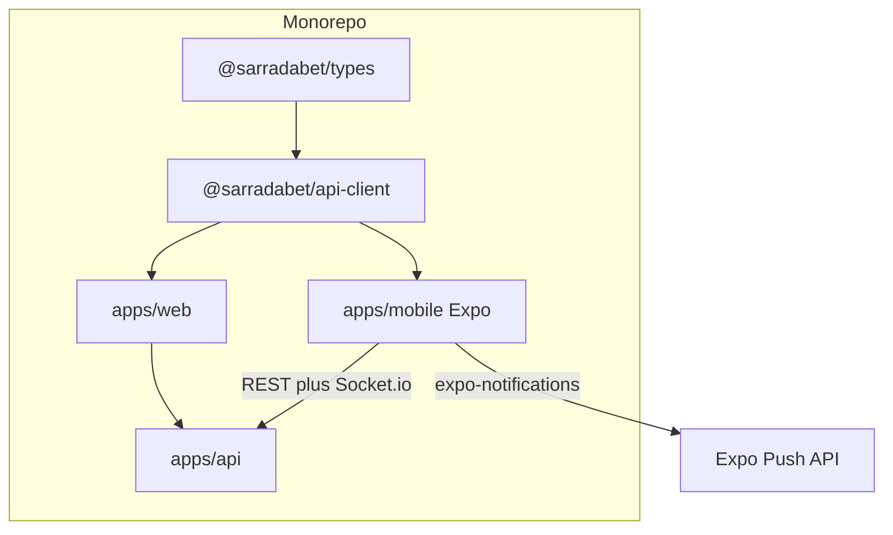

# Feature 06 — Mobile App (React Native) and Advanced Admin Panel

**Status:** Planned

## Prompt summary

Build a React Native + Expo mobile app in the monorepo, sharing types and API client packages. Implement auth with local token storage, automatic refresh, and Socket.io for live odds. Add push notifications for important events. In parallel, enhance the web admin panel: user management (ban, adjust coins), rewards CRUD, Pix payment monitoring, and analytics dashboards with charts. Restrict all admin routes to administrators.

## Current state in SarradaBet

### Mobile

| Item | Status |
|------|--------|
| `apps/mobile` | Does not exist |
| `@sarradabet/api-client` | Does not exist — only [`@sarradabet/types`](../../packages/types/) |
| Push notifications | Not implemented |

### Admin panel (web)

| Page | Path | Status |
|------|------|--------|
| Dashboard | [`AdminDashboard.tsx`](../../apps/web/src/pages/AdminDashboard.tsx) | Done — stats/charts |
| Bets | [`AdminBetsPage.tsx`](../../apps/web/src/pages/AdminBetsPage.tsx) | Done — CRUD + resolve |
| Categories | [`AdminCategoriesPage.tsx`](../../apps/web/src/pages/AdminCategoriesPage.tsx) | Done — CRUD |
| Coin packages | [`AdminCoinPackagesPage.tsx`](../../apps/web/src/pages/AdminCoinPackagesPage.tsx) | Done — CRUD |
| Rewards | [`AdminRewardsPage.tsx`](../../apps/web/src/pages/AdminRewardsPage.tsx) | Done — CRUD |
| Users | [`AdminUsersPage.tsx`](../../apps/web/src/pages/AdminUsersPage.tsx) | Partial — list + coin adjust (no ban) |
| Admin layout + auth | [`AdminLayout.tsx`](../../apps/web/src/components/admin/AdminLayout.tsx), [`useAdminAuth.ts`](../../apps/web/src/hooks/useAdminAuth.ts) | Done |

### Missing admin capabilities

- User ban/unban
- Manual coin adjustment per user
- Pix payment monitor (pending/approved/expired)

### RBAC

- `UserRole.ADMIN` enforced via [`AuthMiddleware`](../../apps/api/src/core/middleware/AuthMiddleware.ts) (`authenticateAdmin`)
- No `SUPER_ADMIN` tier yet — optional extension mentioned in original prompt

## Recommended technical references

| Topic | Reference |
|-------|-----------|
| React Native | [Expo docs](https://docs.expo.dev/) |
| Local storage | `@react-native-async-storage/async-storage` for access token |
| Secure storage | `expo-secure-store` for refresh token (optional — cookie refresh harder on mobile; may use body/header refresh) |
| Socket.io client | `socket.io-client` with auto-reconnect |
| Push | `expo-notifications` + Expo push API |
| Monorepo | Turborepo — add `apps/mobile`, `packages/api-client` |
| Web charts | Recharts (already used in admin) |
| RBAC | Extend `authenticateAdmin`; optional `SUPER_ADMIN` role |

## Proposed monorepo layout

```
sarradabet/
├── apps/
│   ├── api/           # existing
│   ├── web/           # existing
│   └── mobile/        # NEW — Expo app
├── packages/
│   ├── types/         # extend shared DTOs
│   ├── api-client/    # NEW — fetch wrapper, auth refresh, typed endpoints
│   └── config/        # shared tsconfig
```

### `@sarradabet/api-client` responsibilities

- Base URL from env
- Attach `Authorization: Bearer` header
- On 401, call refresh endpoint and retry
- Typed methods: `auth.login`, `bets.list`, `coins.getBalance`, `payments.createPix`, etc.
- Socket.io factory with auth token in handshake

### Mobile auth note

HttpOnly cookies do not work the same on React Native. Options:

1. Store refresh token in `expo-secure-store` and send in request body/header on refresh
2. Extend API to accept refresh token in `Authorization` header for mobile clients
3. Use long-lived access token + biometric re-auth (less secure — not recommended)

Document chosen approach in mobile README when implementing.

## Proposed schema / API changes

### User ban

```prisma
model User {
  isBanned    Boolean   @default(false) @map("is_banned")
  bannedAt    DateTime? @map("banned_at")
  bannedReason String?  @map("banned_reason")
}
```

Middleware: reject auth for `isBanned` users.

### Admin endpoints (new)

| Method | Route | Description |
|--------|-------|-------------|
| GET | `/api/v1/admin/users` | Paginated user list with filters |
| PATCH | `/api/v1/admin/users/:id/ban` | Ban/unban |
| POST | `/api/v1/admin/users/:id/coins/adjust` | Credit/debit with `ADMIN_ADJUSTMENT` |
| GET | `/api/v1/admin/payments/pix` | Monitor Pix payments by status |
| CRUD | `/api/v1/admin/rewards` | Shipped — see [API.md](../API.md) |
| GET | `/api/v1/admin/analytics/*` | Shipped — see [API.md](../API.md) |

### Push notifications

```prisma
model PushToken {
  userId   Int    @map("user_id")
  token    String @unique
  platform String // ios | android
  user     User   @relation(...)
}
```

Events to push: payment confirmed, bet won, reward redeemed.

## Architecture (proposed)


```mermaid
flowchart TB
  subgraph monorepo [Monorepo]
    types["@sarradabet/types"]
    apiClient["@sarradabet/api-client"]
    mobile[apps/mobile Expo]
    web[apps/web]
    api[apps/api]
  end

  types --> apiClient
  apiClient --> mobile
  apiClient --> web
  mobile -->|REST plus Socket.io| api
  web --> api
  mobile -->|expo-notifications| pushGateway[Expo Push API]
```

## Gherkin Specifications (BDD)

Os seguintes cenários Gherkin definem o comportamento esperado para o aplicativo mobile, painel administrativo avançado, gerenciamento de usuários, notificações push e permissões. Eles devem ser implementados como testes E2E executáveis usando Playwright + Cucumber (para web) e/ou testes de integração (para mobile).

```gherkin
Funcionalidade: Aplicativo Mobile e Painel Administrativo Avançado
  Como um usuário, administrador e desenvolvedor
  Eu quero acessar o sistema via mobile, gerenciar usuários e receber notificações
  Para que a experiência seja multiplataforma e a administração seja completa

  # ============================================
  # PARTE 1 — AUTENTICAÇÃO MOBILE
  # ============================================

  @smoke @mobile
  Cenário: Usuário faz login no aplicativo mobile com sucesso
    Dado que o aplicativo mobile está instalado e aberto
    Quando o usuário insere "test@example.com" e "password123"
    E clica em "Entrar"
    Então o token de acesso é armazenado localmente via AsyncStorage
    E o usuário é redirecionado para a tela inicial
    E o cabeçalho "Authorization: Bearer" é incluído em todas as requisições seguintes

  @smoke @mobile
  Cenário: Token de acesso expirado é renovado automaticamente
    Dado que o usuário está autenticado com um token expirado
    Quando o usuário tenta acessar uma rota protegida (ex: lista de apostas)
    Então o api-client detecta HTTP 401
    E automaticamente faz uma requisição para o endpoint de refresh
    E obtém um novo token de acesso
    E a requisição original é repetida com sucesso
    E o usuário não percebe a renovação

  @mobile @auth
  Cenário: Usuário faz logout no aplicativo mobile
    Dado que o usuário está autenticado no mobile
    Quando o usuário clica em "Sair"
    Então o token de acesso e o refresh token são removidos do armazenamento local
    E o usuário é redirecionado para a tela de login
    E requisições posteriores não incluem cabeçalho de autorização

  # ============================================
  # PARTE 2 — FEATURES DO APLICATIVO MOBILE
  # ============================================

  @smoke @mobile
  Cenário: Usuário visualiza lista de apostas com odds ao vivo via Socket.io
    Dado que o usuário está autenticado no mobile
    Quando o usuário navega para a tela "Apostas"
    Então a lista de apostas é carregada via REST
    E a conexão Socket.io é estabelecida com o token de autenticação no handshake
    E as odds são atualizadas em tempo real sem recarregar a página
    E o usuário vê indicadores visuais de "ao vivo" nas apostas em andamento

  @smoke @mobile
  Cenário: Usuário compra moedas via PIX no aplicativo mobile
    Dado que o usuário está autenticado no mobile
    Quando o usuário navega para a tela "Comprar Moedas"
    E seleciona um pacote de moedas (ex: "100 moedas por R$ 10,00")
    E clica em "Comprar com PIX"
    Então o aplicativo gera uma requisição de pagamento
    E exibe um QR Code PIX ou código copia e cola
    E o status do pagamento é monitorado via polling ou WebSocket
    Quando o pagamento é confirmado, o saldo do usuário é atualizado automaticamente

  @mobile @dashboard
  Cenário: Usuário visualiza seu dashboard no mobile
    Dado que o usuário está autenticado no mobile
    Quando o usuário navega para a tela "Perfil" ou "Dashboard"
    Então o aplicativo faz uma requisição para "/api/v1/users/me/dashboard"
    E exibe:
      | campo              | formato                       |
      | Saldo de moedas    | Número com duas casas decimais |
      | Total de apostas   | Número inteiro                 |
      | Taxa de vitórias   | Percentual (ex: 43%)          |
      | Posição no ranking | Número (ex: #12)              |
      | Histórico recente  | Lista de apostas e transações  |

  # ============================================
  # PARTE 3 — NOTIFICAÇÕES PUSH
  # ============================================

  @smoke @push
  Cenário: Usuário recebe notificação push quando pagamento PIX é confirmado
    Dado que o usuário tem um token de push registrado no dispositivo
    Quando um pagamento PIX é aprovado para o usuário
    Então o sistema dispara uma notificação push via Expo Push API
    E o dispositivo recebe a notificação com:
      | campo     | valor                                |
      | título    | "Pagamento confirmado!"              |
      | corpo     | "Seu pagamento de R$ 10,00 foi aprovado. 100 moedas adicionadas!" |
      | dados     | { "type": "payment_confirmed", "coins": 100 } |

  @smoke @push
  Cenário: Usuário recebe notificação push quando ganha uma aposta
    Dado que o usuário tem um token de push registrado
    E o usuário tinha uma aposta na odd vencedora
    Quando a aposta é resolvida e o pagamento é processado
    Então o sistema dispara uma notificação push
    E o dispositivo recebe a notificação com:
      | campo     | valor                                    |
      | título    | "Você ganhou sua aposta!"               |
      | corpo     | "Parabéns! Você recebeu 200 moedas pela aposta 'Jogo 1'." |
      | dados     | { "type": "bet_won", "betId": "1", "amount": 200 } |

  @push
  Cenário: Usuário recebe notificação push quando resgata uma recompensa
    Dado que o usuário tem um token de push registrado
    Quando o usuário resgata uma recompensa com sucesso
    Então o sistema dispara uma notificação push
    E o dispositivo recebe a notificação com:
      | campo     | valor                                    |
      | título    | "Recompensa resgatada!"                 |
      | corpo     | "Você resgatou 'Camisa Oficial'. Apresente seu ticket na loja." |
      | dados     | { "type": "reward_redeemed", "rewardId": "1", "ticket": "abc-123" } |

  @push @registration
  Cenário: Token de push é registrado no login do mobile
    Dado que o aplicativo mobile está instalado e o usuário fez login
    Quando o aplicativo obtém o token de push via expo-notifications
    Então o token é enviado para o endpoint "/api/v1/notifications/register-token"
    E o token é armazenado na tabela "PushToken" associado ao "userId" do usuário

  @push @registration
  Cenário: Token de push é removido no logout
    Dado que o usuário está autenticado e possui um token de push registrado
    Quando o usuário faz logout no mobile
    Então o token de push é removido da tabela "PushToken" para aquele dispositivo
    E o usuário não recebe mais notificações push naquele dispositivo

  # ============================================
  # PARTE 4 — PAINEL ADMIN — GERENCIAMENTO DE USUÁRIOS
  # ============================================

  Contexto: Painel Administrativo
    Dado que um administrador "Admin" está autenticado

  @smoke @admin
  Cenário: Administrador visualiza lista paginada de usuários
    Quando o administrador acessa "/api/v1/admin/users"
    Então a resposta contém uma lista paginada de usuários
    E cada usuário exibe:
      | campo         | descrição                    |
      | id            | ID do usuário                |
      | email         | Email do usuário             |
      | name          | Nome do usuário              |
      | coinBalance   | Saldo de moedas              |
      | isBanned      | Status de banimento          |
      | createdAt     | Data de criação              |
    E a resposta inclui metadados de paginação (total, page, limit, totalPages)

  @smoke @admin
  Cenário: Administrador busca usuário por email ou nome
    Quando o administrador faz uma requisição GET para "/api/v1/admin/users?search=test@example.com"
    Então a resposta contém apenas usuários que correspondem ao termo de busca
    E a busca é case-insensitive

  @smoke @admin
  Cenário: Administrador bane um usuário
    Dado que o usuário "Jogador" existe e está ativo
    Quando o administrador faz uma requisição PATCH para "/api/v1/admin/users/123/ban"
      E o corpo contém: { "isBanned": true, "reason": "Comportamento inadequado" }
    Então o campo "isBanned" do usuário "Jogador" é atualizado para "true"
    E o campo "bannedAt" é preenchido com a data atual
    E o campo "bannedReason" armazena "Comportamento inadequado"

  @admin
  Cenário: Administrador desbane um usuário
    Dado que o usuário "Jogador" está banido
    Quando o administrador faz uma requisição PATCH para "/api/v1/admin/users/123/ban"
      E o corpo contém: { "isBanned": false }
    Então o campo "isBanned" do usuário "Jogador" é atualizado para "false"
    E o campo "bannedAt" é definido como "null"
    E o campo "bannedReason" é definido como "null"

  @admin @auth
  Cenário: Usuário banido é bloqueado em todas as rotas autenticadas
    Dado que o usuário "Jogador" está banido
    Quando o usuário "Jogador" tenta acessar qualquer rota autenticada (ex: "/api/v1/users/me")
    Então o sistema retorna erro HTTP 403 com mensagem "Usuário banido"
    E o usuário não consegue realizar nenhuma ação no sistema

  @smoke @admin
  Cenário: Administrador ajusta saldo de moedas de um usuário
    Dado que o usuário "Jogador" tem saldo de "500" moedas
    Quando o administrador faz uma requisição POST para "/api/v1/admin/users/123/coins/adjust"
      E o corpo contém: { "amount": 200, "reason": "Bônus promocional" }
    Então o saldo do usuário "Jogador" aumenta para "700" moedas
    E uma transação "ADMIN_ADJUSTMENT" é registrada com:
      | campo      | valor                |
      | amount     | 200                  |
      | source     | ADMIN_ADJUSTMENT     |
      | metadata   | { "reason": "Bônus promocional", "adminId": 1 } |

  @admin @validation
  Cenário: Administrador não pode ajustar saldo com valor zero ou negativo
    Quando o administrador tenta ajustar o saldo com "amount = 0"
    Então o sistema rejeita a requisição com erro "Valor deve ser diferente de zero"
    E retorna HTTP 400 (Bad Request)

  # ============================================
  # PARTE 5 — PAINEL ADMIN — MONITORAMENTO PIX
  # ============================================

  @smoke @admin
  Cenário: Administrador visualiza lista de pagamentos PIX com filtro por status
    Quando o administrador acessa "/api/v1/admin/payments/pix?status=PENDING"
    Então a resposta contém apenas pagamentos com status "PENDING"
    E cada pagamento exibe:
      | campo         | descrição                    |
      | id            | ID do pagamento              |
      | userId        | ID do usuário                |
      | amountCents   | Valor em centavos            |
      | status        | Status (PENDING/APPROVED/EXPIRED) |
      | qrCode        | QR Code (se disponível)      |
      | paidAt        | Data de pagamento (se aprovado) |
      | expiresAt     | Data de expiração            |

  @admin
  Cenário: Administrador visualiza detalhes de um pagamento PIX específico
    Quando o administrador acessa "/api/v1/admin/payments/pix/123"
    Então a resposta contém todos os detalhes do pagamento
    E inclui informações do usuário (email, nome) relacionadas ao pagamento

  @admin
  Cenário: Administrador filtra pagamentos PIX por data e usuário
    Quando o administrador acessa "/api/v1/admin/payments/pix?startDate=2026-01-01&endDate=2026-01-31&userId=123"
    Então a resposta contém apenas pagamentos do período especificado e do usuário "123"

  # ============================================
  # PARTE 6 — PAINEL ADMIN — ANALYTICS AVANÇADO
  # ============================================

  @smoke @admin
  Cenário: Administrador visualiza painel de analytics com filtros de data e categoria
    Quando o administrador acessa a página de analytics
    E seleciona "startDate=2026-01-01" e "endDate=2026-01-31"
    Então os gráficos são atualizados para refletir o período selecionado
    E o usuário pode filtrar por categoria através de um dropdown

  @admin
  Cenário: Administrador exporta relatório de analytics em CSV
    Quando o administrador clica no botão "Exportar CSV"
    Então uma requisição GET é feita para "/api/v1/admin/analytics/export?startDate=2026-01-01&endDate=2026-01-31"
    E o navegador inicia o download de um arquivo CSV
    E o arquivo contém os cabeçalhos e dados corretos

  # ============================================
  # PARTE 7 — PAINEL ADMIN — REWARDS CRUD
  # ============================================

  @smoke @admin
  Cenário: Administrador visualiza lista de recompensas
    Quando o administrador acessa "/api/v1/admin/rewards"
    Então a resposta contém todas as recompensas (ativas e inativas)
    E cada recompensa exibe: id, title, description, coinCost, stock, imageUrl, isActive

  @admin
  Cenário: Administrador cria uma nova recompensa
    Quando o administrador envia uma requisição POST para "/api/v1/admin/rewards"
      E o corpo contém:
        | campo        | valor              |
        | title        | Camisa Oficial     |
        | description  | Camisa autografada |
        | coinCost     | 1000               |
        | stock        | 10                 |
        | imageUrl     | https://...        |
    Então a recompensa é criada com "isActive = true" por padrão
    E a resposta contém a recompensa criada com seu "id"

  @admin
  Cenário: Administrador atualiza uma recompensa existente
    Dado que existe uma recompensa "Camisa Oficial" com stock "10"
    Quando o administrador envia uma requisição PATCH para "/api/v1/admin/rewards/1"
      E o corpo contém: { "stock": 15, "coinCost": 1200 }
    Então a recompensa é atualizada com os novos valores
    E o campo "updatedAt" é atualizado

  @admin
  Cenário: Administrador desativa uma recompensa (soft delete)
    Quando o administrador envia uma requisição PATCH para "/api/v1/admin/rewards/1"
      E o corpo contém: { "isActive": false }
    Então a recompensa não aparece mais no catálogo público ("/api/v1/rewards")
    Mas ainda está visível no painel administrativo

  # ============================================
  # PARTE 8 — RBAC E SEGURANÇA
  # ============================================

  @admin @auth
  Cenário: Usuário comum não acessa rotas administrativas
    Dado que um usuário comum "Jogador" está autenticado
    Quando o usuário tenta acessar qualquer rota "/api/v1/admin/*"
    Então o sistema retorna erro HTTP 403 (Forbidden)

  @admin @auth
  Cenário: Rotas administrativas exigem autenticação
    Dado que nenhum usuário está autenticado
    Quando uma requisição é feita para "/api/v1/admin/users"
    Então o sistema retorna erro HTTP 401 (Unauthorized)

  @admin @auth
  Cenário: Apenas administradores podem acessar o painel administrativo no frontend
    Dado que um usuário comum "Jogador" está autenticado na web
    Quando o usuário tenta navegar para "/admin"
    Então o frontend redireciona o usuário para "/"
    E exibe uma mensagem "Acesso negado"

  # ============================================
  # PARTE 9 — CASOS DE BORDA
  # ============================================

  @edge @mobile
  Cenário: Aplicativo mobile lida com perda de conexão de rede
    Dado que o aplicativo mobile está em uso
    Quando a conexão de rede é perdida
    Então o aplicativo exibe um banner "Sem conexão com a internet"
    E as requisições falham silenciosamente com retry automático
    Quando a conexão é restaurada, as requisições são reenviadas automaticamente

  @edge @push
  Cenário: Notificação push não é enviada quando token de push não está registrado
    Dado que o usuário não possui token de push registrado
    Quando um evento de notificação (ex: pagamento confirmado) ocorre
    Então o sistema não tenta enviar a notificação push
    E registra um log de aviso "Usuário sem token de push registrado"
    E a operação principal (ex: crédito de moedas) não é afetada

  @edge @admin
  Cenário: Administrador não pode banir a si mesmo
    Dado que o administrador "Admin" está autenticado
    Quando o administrador tenta banir seu próprio usuário
    Então o sistema rejeita a requisição com erro "Não é possível banir a si mesmo"
    E retorna HTTP 400 (Bad Request)

  @edge @admin
  Cenário: Sistema registra auditoria de ações administrativas
    Dado que o administrador realiza uma ação (ban, ajuste de moedas, etc.)
    Quando a ação é executada
    Então um registro de auditoria é criado com:
      | campo       | descrição                           |
      | adminId     | ID do administrador que executou    |
      | action      | Tipo da ação (BAN, COIN_ADJUST, etc.) |
      | targetId    | ID do usuário alvo                  |
      | metadata    | Detalhes da ação (reason, amount)   |
      | createdAt   | Timestamp da ação                   |
```

## Implementation checklist

### Monorepo setup

- [ ] `npx create-expo-app apps/mobile` with TypeScript
- [ ] Add `packages/api-client` with typed fetch + refresh
- [ ] Configure Turborepo tasks for mobile (`dev`, `build`)
- [ ] Share `@sarradabet/types` in mobile/tsconfig paths

### Mobile app

- [ ] Auth screens: login, register
- [ ] Token storage + auto refresh via api-client
- [ ] Home: bet list with live odds (Socket.io)
- [ ] Coins: purchase flow (display QR or deep link)
- [ ] Profile/dashboard (uses `/api/v1/users/me/dashboard` — see [API.md](../API.md))
- [ ] Push: register token on login, handle notifications
- [ ] Navigation: React Navigation

### Advanced admin (web)

- [ ] Admin users page: list, search, ban
- [ ] Admin Pix monitor: filter by status, view details
- [x] Admin rewards CRUD — shipped
- [x] Analytics dashboards — shipped
- [x] Confirm all `/admin/*` routes use `authenticateAdmin`

### Backend

- [ ] Ban middleware on auth routes
- [ ] Admin user management endpoints
- [x] Admin coin adjustment via `CoinService` + audit log
- [ ] Push token registration endpoint
- [ ] Notification service triggered from payment/payout events

## Key files

| Path | Action |
|------|--------|
| `apps/mobile/` | **create** — entire Expo app |
| `packages/api-client/` | **create** |
| [`packages/types/src/`](../../packages/types/src/) | **extend** |
| [`apps/web/src/pages/`](../../apps/web/src/pages/) | **create** — AdminUsersPage, AdminPaymentsPage |
| [`AdminLayout.tsx`](../../apps/web/src/components/admin/AdminLayout.tsx) | **extend** — nav links |
| [`apps/api/src/modules/user/`](../../apps/api/src/modules/user/) | **extend** — ban, admin list |
| `apps/api/src/modules/notification/` | **create** |
| [`turbo.json`](../../turbo.json) | **extend** — mobile tasks |

## Acceptance criteria

- [ ] Mobile app builds with Expo; login and bet list work against API
- [ ] Access token refreshes automatically without user action
- [ ] Odds update in real time on mobile via Socket.io
- [ ] Push notification received on payment confirmation (device registered)
- [ ] Admin can ban user; banned user receives 403 on all authenticated routes
- [ ] Admin can adjust coins; `ADMIN_ADJUSTMENT` transaction recorded
- [ ] Admin can view Pix payments filtered by status
- [ ] Non-admin cannot access any `/admin/*` API route or page

## Dependencies

Shipped prerequisites (documented in living refs):

- [API.md](../API.md) — auth, coins/Pix, votes, gamification, dashboard, analytics, instore QR
- [ARCHITECTURE.md](../ARCHITECTURE.md) — module layout, realtime, caching

## Test plan

| Area | Tests |
|------|-------|
| api-client | Unit: refresh retry, error handling |
| API | Integration: ban, coin adjust, admin 403 |
| Mobile | Detox or Maestro E2E (optional); manual QA checklist |
| Admin web | Vitest component tests for new pages |

Run API tests: `npm run test --workspace=apps/api`

Mobile: `npm run test --workspace=apps/mobile` (once configured)