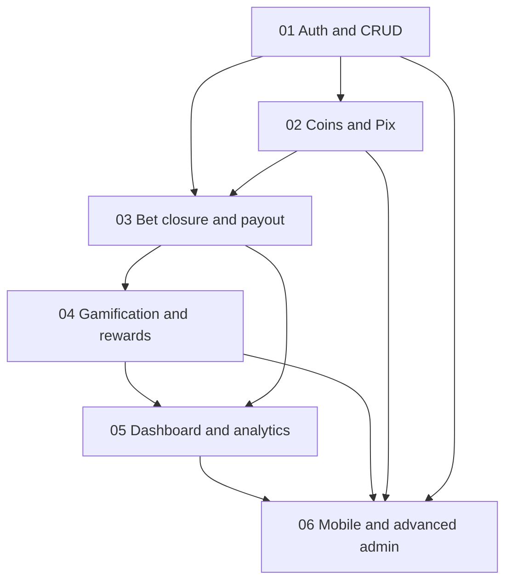

# Feature Implementation Guides

Reference docs for planned and in-progress SarradaBet features. Each guide maps an original implementation prompt to the current codebase, gaps, and an actionable checklist.

Use these when starting a new feature branch or onboarding an agent — they are **spec + status + file map**, not user-facing product docs.

## Status matrix

| # | Feature | Status | Guide | Depends on |
|---|---------|--------|-------|------------|
| 01 | User auth & CRUD | **Partial** | [01-user-auth-and-crud.md](./01-user-auth-and-crud.md) | — |
| 02 | Coins & Pix payments | **Partial** | [02-coins-and-pix-payments.md](./02-coins-and-pix-payments.md) | 01 |
| 03 | Bet closure & payout | **Planned** | [03-bet-closure-and-payout.md](./03-bet-closure-and-payout.md) | 01, 02 |
| 04 | Gamification & rewards | **Planned** | [04-gamification-and-rewards.md](./04-gamification-and-rewards.md) | 01–03 |
| 05 | Dashboard & analytics | **Planned** | [05-dashboard-and-analytics.md](./05-dashboard-and-analytics.md) | 03, 04 |
| 06 | Mobile app & advanced admin | **Planned** | [06-mobile-app-and-admin-panel.md](./06-mobile-app-and-admin-panel.md) | 01–05 |
| 07 | Mercado Pago QR instore | **Partial** | [07-mercadopago-qr-instore.md](./07-mercadopago-qr-instore.md) | 02 |

**Legend:** *Partial* = backend or UI exists but prompt requirements are not fully met. *Planned* = not started or schema-only stubs.

## Recommended implementation order

## Shared doc structure

Every guide includes:

1. Status badge
2. Prompt summary
3. Current state in SarradaBet
4. Gaps vs prompt
5. Recommended technical references
6. Proposed schema / API changes
7. Implementation checklist
8. Key files table
9. Acceptance criteria
10. Dependencies
11. Test plan

## Related documentation

- [Architecture](../ARCHITECTURE.md) — clean architecture, realtime, caching
- [API Reference](../API.md) — REST + Socket.io (auth section complete; coins/pix pending)
- [Developer Guide](../DEVELOPER_GUIDE.md) — setup, conventions, testing
